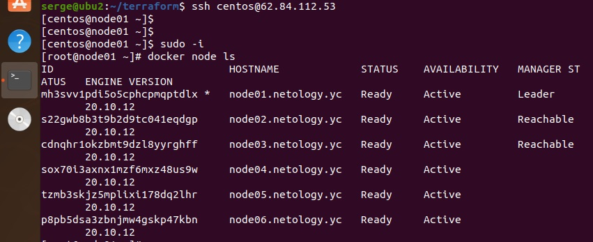
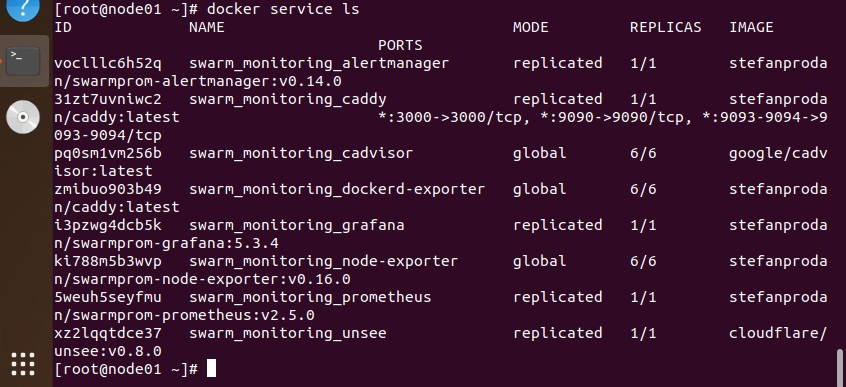

# devops-netology
# Домашнее задание к занятию "5.5. Оркестрация кластером Docker контейнеров на примере Docker Swarm"

## Задача 1

Дайте письменые ответы на следующие вопросы:

* В чём отличие режимов работы сервисов в Docker Swarm кластере: replication и global?
* Какой алгоритм выбора лидера используется в Docker Swarm кластере?
* Что такое Overlay Network?

Ответ:

* В режиме кластера существует два типа служб: службы репликации и глобальные службы. 
Для глобальных сервисов планировщик размещает задачу на каждом доступном узле, даже на "manager node",
без ограничений. По умолчанию используется тип копии. Для службы репликации мы можем указать количество задач 
репликации, которые будут запускаться с использованием реплик. Глобальные используем для систем мониторинга,
replication для конкретно заданного количества экземпляров.

* алгоритм выбора Raft.

* Оверлей  — это сетевой драйвер для соединения несколько демонов Docker между собой и которые позволяют 
docker-swarm службам взаимодействовать друг с другом. Оверлейные сети соединяют вместе несколько демонов Docker 
и позволяют службам Docker Swarm взаимодействовать друг с другом в режиме кластера. Это общий случай логической сети,
создаваемой поверх другой сети. Узлы оверлейной сети могут быть связаны либо физическим соединением, либо логическим,
для которого в основной сети существуют один или несколько соответствующих маршрутов из физических соединений. 
Эта стратегия устраняет необходимость выполнять маршрутизацию на уровне ОС между этими контейнерами.

## Задача 2
## Создать ваш первый Docker Swarm кластер в Яндекс.Облаке

Для получения зачета, вам необходимо предоставить скриншот из терминала (консоли), с выводом команды:
```bash
docker node ls
```

Ответ:



## Задача 3

## Создать ваш первый, готовый к боевой эксплуатации кластер мониторинга, состоящий из стека микросервисов.

Для получения зачета, вам необходимо предоставить скриншот из терминала (консоли), с выводом команды:
```bash
docker service ls
```

Ответ:




