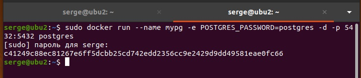
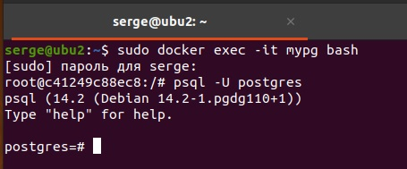

# devops-netology
## Домашнее задание к занятию "6.2. SQL"

## Задача 1

Используя docker поднимите инстанс PostgreSQL (версию 12) c 2 volume, в который будут складываться данные БД и бэкапы.

Приведите получившуюся команду или docker-compose манифест.

Ответ:
```bash
serge@ubu2:~$ sudo docker pull postgres
[sudo] пароль для serge: 
Using default tag: latest
latest: Pulling from library/postgres
5eb5b503b376: Pull complete 
daa0467a6c48: Pull complete 
7cf625de49ef: Pull complete 
bb8afcc973b2: Pull complete 
c74bf40d29ee: Pull complete 
2ceaf201bb22: Pull complete 
1255f255c0eb: Pull complete 
12a9879c7aa1: Pull complete 
4e80271c8de8: Pull complete 
04d0275af286: Pull complete 
3d4fe3f39342: Pull complete 
60f2aefbd6d9: Pull complete 
98ace1022c39: Pull complete 
Digest: sha256:156c50d4b6fe6ea4e4645ccdeabf54fedc59a561bfece047cdf4c26a42deab72
Status: Downloaded newer image for postgres:latest
docker.io/library/postgres:latest
```

```bash
serge@ubu2:~$ sudo docker run --name mypg -e POSTGRES_PASSWORD=postgres -d -p 5432:5432 postgres
234fda2d1953c80363a85faa046dfb1d1551821fe4746664ce157a90ad91a38e
serge@ubu2:~$ 
```



```bash
serge@ubu2:~$ sudo apt install postgresql-client-common
[sudo] пароль для serge: 
Чтение списков пакетов… Готово
Построение дерева зависимостей       
Чтение информации о состоянии… Готово
Следующий пакет устанавливался автоматически и больше не требуется:
  qemu
Для его удаления используйте «sudo apt autoremove».
Следующие НОВЫЕ пакеты будут установлены:
  postgresql-client-common
Обновлено 0 пакетов, установлено 1 новых пакетов, для удаления отмечено 0 пакетов, и 0 пакетов не обновлено.
Необходимо скачать 28,2 kB архивов.
После данной операции объём занятого дискового пространства возрастёт на 182 kB.
Пол:1 http://ru.archive.ubuntu.com/ubuntu focal-updates/main amd64 postgresql-client-common all 214ubuntu0.1 [28,2 kB]
Получено 28,2 kB за 0с (84,1 kB/s)                   
Выбор ранее не выбранного пакета postgresql-client-common.
(Чтение базы данных … на данный момент установлено 171408 файлов и каталогов.)
Подготовка к распаковке …/postgresql-client-common_214ubuntu0.1_all.deb …
Распаковывается postgresql-client-common (214ubuntu0.1) …
Настраивается пакет postgresql-client-common (214ubuntu0.1) …
Обрабатываются триггеры для man-db (2.9.1-1) …
serge@ubu2:~$ 
```

```bash
sudo docker run --name mypg -e POSTGRES_PASSWORD=postgres -d -p 5432:5432 postgres
[sudo] пароль для serge: 
c41249c88ec81267e6ff5dcbb25cd742edd2356cc9e2429d9dd49581eae0fc66
serge@ubu2:~$
```
Подключение к контейнеру, Внутри него подключение к psql::

```bash
serge@ubu2:~$ sudo docker exec -it mypg bash
root@234fda2d1953:/# 
root@234fda2d1953:/# 
root@234fda2d1953:/# 
root@234fda2d1953:/# psql -U postgres
psql (14.2 (Debian 14.2-1.pgdg110+1))
Type "help" for help.
```
```bash
postgres=# 
```



## Задача 2

В БД из задачи 1:
* создайте пользователя test-admin-user и БД test_db
* в БД test_db создайте таблицу orders и clients (спeцификация таблиц ниже)
* предоставьте привилегии на все операции пользователю test-admin-user на таблицы БД test_db
* создайте пользователя test-simple-user
* предоставьте пользователю test-simple-user права на SELECT/INSERT/UPDATE/DELETE данных таблиц БД test_db

Таблица orders:
* id (serial primary key)
* наименование (string)
* цена (integer)

Таблица clients:
* id (serial primary key)
* фамилия (string)
* страна проживания (string, index)
* заказ (foreign key orders)

Приведите:
* итоговый список БД после выполнения пунктов выше,
* описание таблиц (describe)
* SQL-запрос для выдачи списка пользователей с правами над таблицами test_db
* список пользователей с правами над таблицами test_db

Ответ:
```bash
postgres=# CREATE DATABASE test_db;
CREATE DATABASE
postgres=# 
postgres=# CREATE USER test_admin_user WITH PASSWORD 'admintest';
CREATE ROLE
postgres=# 
postgres=# CREATE USER test_simple_user WITH PASSWORD 'usertest';
CREATE ROLE
```

```bash
postgres=# GRANT SELECT, UPDATE, INSERT ON ALL TABLES IN SCHEMA public TO "test_simple_user";
GRANT
postgres=# GRANT ALL PRIVILEGES ON ALL TABLES IN SCHEMA public TO "test_admin_user";
GRANT
```

```bash
postgres=# CREATE TABLE orders (id SERIAL PRIMARY KEY, name TEXT, price INTEGER);
CREATE TABLE
postgres=# 
postgres=# CREATE TABLE clients (id SERIAL PRIMARY KEY, surname TEXT, country TEXT, id_value CHAR(8) NOT NULL, shopping INTEGER, FOREIGN KEY (shopping) REFERENCES orders (id));
CREATE TABLE
```

описание таблиц

```bash
select column_name, data_type, character_maximum_length
from INFORMATION_SCHEMA.COLUMNS where table_name = 'clients';
 column_name | data_type | character_maximum_length 
-------------+-----------+--------------------------
 id          | integer   |                         
 shopping    | integer   |                         
 surname     | text      |                         
 country     | text      |                         
 id_value    | character |                        8
(5 rows)
```

```bash
select column_name, data_type, character_maximum_length
from INFORMATION_SCHEMA.COLUMNS where table_name = 'orders';
 column_name | data_type | character_maximum_length 
-------------+-----------+--------------------------
 id          | integer   |                         
 price       | integer   |                         
 name        | text      |                         
(3 rows)
```

```bash
\l
                                    List of databases
   Name    |  Owner   | Encoding |  Collate   |   Ctype    |      Access privileges   
    
-----------+----------+----------+------------+------------+--------------------------
----
 postgres  | postgres | UTF8     | en_US.utf8 | en_US.utf8 | 
 template0 | postgres | UTF8     | en_US.utf8 | en_US.utf8 | =c/postgres              
   +
           |          |          |            |            | postgres=CTc/postgres
 template1 | postgres | UTF8     | en_US.utf8 | en_US.utf8 | =c/postgres              
   +
           |          |          |            |            | postgres=CTc/postgres
 test_db   | postgres | UTF8     | en_US.utf8 | en_US.utf8 | =Tc/postgres             
   +
           |          |          |            |            | postgres=CTc/postgres    
   +
           |          |          |            |            | test_admin_user=CTc/postg
res
(4 rows)
```

SQL-запрос для выдачи списка пользователей с правами над таблицами test_db

```bash
SELECT * FROM information_schema.table_privileges WHERE table_schema = 'public';
 grantor  |     grantee      | table_catalog | table_schema | table_name | privilege_t
ype | is_grantable | with_hierarchy 
----------+------------------+---------------+--------------+------------+------------
----+--------------+----------------
 postgres | postgres         | postgres      | public       | orders     | INSERT     
    | YES          | NO
 postgres | postgres         | postgres      | public       | orders     | SELECT     
    | YES          | YES
 postgres | postgres         | postgres      | public       | orders     | UPDATE     
    | YES          | NO
 postgres | postgres         | postgres      | public       | orders     | DELETE     
    | YES          | NO
 postgres | postgres         | postgres      | public       | orders     | TRUNCATE   
    | YES          | NO
 postgres | postgres         | postgres      | public       | orders     | REFERENCES 
    | YES          | NO
 postgres | postgres         | postgres      | public       | orders     | TRIGGER    
    | YES          | NO
 postgres | test_simple_user | postgres      | public       | orders     | INSERT     
    | NO           | NO
 postgres | test_simple_user | postgres      | public       | orders     | SELECT     
    | NO           | YES
 postgres | test_simple_user | postgres      | public       | orders     | UPDATE     

...skipping 1 line
 postgres | test_admin_user  | postgres      | public       | orders     | INSERT     
    | NO           | NO
 postgres | test_admin_user  | postgres      | public       | orders     | SELECT     
    | NO           | YES
 postgres | test_admin_user  | postgres      | public       | orders     | UPDATE     
    | NO           | NO
 postgres | test_admin_user  | postgres      | public       | orders     | DELETE     
    | NO           | NO
 postgres | test_admin_user  | postgres      | public       | orders     | TRUNCATE   
    | NO           | NO
 postgres | test_admin_user  | postgres      | public       | orders     | REFERENCES 
    | NO           | NO
 postgres | test_admin_user  | postgres      | public       | orders     | TRIGGER    
    | NO           | NO
 postgres | postgres         | postgres      | public       | clients    | INSERT     
    | YES          | NO
 postgres | postgres         | postgres      | public       | clients    | SELECT     
    | YES          | YES
 postgres | postgres         | postgres      | public       | clients    | UPDATE     
    | YES          | NO
 postgres | postgres         | postgres      | public       | clients    | DELETE     
    | YES          | NO
 postgres | postgres         | postgres      | public       | clients    | TRUNCATE   

...skipping 1 line
 postgres | postgres         | postgres      | public       | clients    | REFERENCES 
    | YES          | NO
 postgres | postgres         | postgres      | public       | clients    | TRIGGER    
    | YES          | NO
 postgres | test_simple_user | postgres      | public       | clients    | INSERT     
    | NO           | NO
 postgres | test_simple_user | postgres      | public       | clients    | SELECT     
    | NO           | YES
 postgres | test_simple_user | postgres      | public       | clients    | UPDATE     
    | NO           | NO
 postgres | test_admin_user  | postgres      | public       | clients    | INSERT     
    | NO           | NO
 postgres | test_admin_user  | postgres      | public       | clients    | SELECT     
    | NO           | YES
 postgres | test_admin_user  | postgres      | public       | clients    | UPDATE     
    | NO           | NO
 postgres | test_admin_user  | postgres      | public       | clients    | DELETE     
    | NO           | NO
 postgres | test_admin_user  | postgres      | public       | clients    | TRUNCATE   
    | NO           | NO
 postgres | test_admin_user  | postgres      | public       | clients    | REFERENCES 
    | NO           | NO
 postgres | test_admin_user  | postgres      | public       | clients    | TRIGGER    

...skipping 1 line
(34 rows)
```

```bash
SELECT * from information_schema.table_privileges WHERE grantee = 'test_simple_user';
 grantor  |     grantee      | table_catalog | table_schema | table_name | privilege_t
ype | is_grantable | with_hierarchy 
----------+------------------+---------------+--------------+------------+------------
----+--------------+----------------
 postgres | test_simple_user | postgres      | public       | orders     | INSERT     
    | NO           | NO
 postgres | test_simple_user | postgres      | public       | orders     | SELECT     
    | NO           | YES
 postgres | test_simple_user | postgres      | public       | orders     | UPDATE     
    | NO           | NO
 postgres | test_simple_user | postgres      | public       | clients    | INSERT     
    | NO           | NO
 postgres | test_simple_user | postgres      | public       | clients    | SELECT     
    | NO           | YES
 postgres | test_simple_user | postgres      | public       | clients    | UPDATE     
    | NO           | NO
(6 rows)
```

## Задача 3

Используя SQL синтаксис - наполните таблицы следующими тестовыми данными:

Таблица orders:

| Наименование	| цена | 
|:---------------|-----:|           
|    Шоколад	 | 10   |
|Принтер	    | 3000 |
|Книга	        |  500 |
|Монитор       | 7000 |
|Гитара	| 4000 |

Таблица clients:

| ФИО	| страна проживания |
|:------|------------------:|
|Иванов Иван Иванович |	USA
|Петров Петр Петрович |	Canada
|Иоганн Себастьян Бах |	Japan
|Ронни Джеймс Дио |	Russia
|Ritchie Blackmore |	Russia

Используя SQL синтаксис:
* вычислите количество записей для каждой таблицы
* приведите в ответе:
- запросы
- результаты их выполнения.

