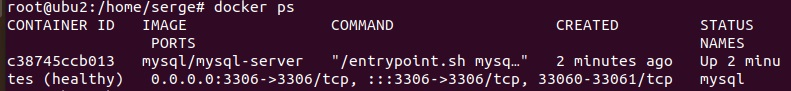

# devops-netology
## Домашнее задание к занятию "6.3. MySQL"

## Задача 1

Используя docker поднимите инстанс MySQL (версию 8). Данные БД сохраните в volume.

Изучите бэкап БД и восстановитесь из него.

Перейдите в управляющую консоль mysql внутри контейнера.

Используя команду \h получите список управляющих команд.

Найдите команду для выдачи статуса БД и приведите в ответе из ее вывода версию сервера БД.

Подключитесь к восстановленной БД и получите список таблиц из этой БД.

Приведите в ответе количество записей с price > 300.

В следующих заданиях мы будем продолжать работу с данным контейнером.

Ответ:
```bash
root@ubu2:/home/serge# docker run --name=mysql -d -p 3306:3306 mysql/mysql-server
Unable to find image 'mysql/mysql-server:latest' locally
latest: Pulling from mysql/mysql-server
221c7ea50c9e: Pull complete 
d32a20f3a6af: Pull complete 
28749a63c815: Pull complete 
3cdab959ca41: Pull complete 
30ceffa70af4: Pull complete 
e4b028b699c1: Pull complete 
3abed4e8adad: Pull complete 
Digest: sha256:6fca505a0d41c7198b577628584e01d3841707c3292499baae87037f886c9fa2
Status: Downloaded newer image for mysql/mysql-server:latest
d4b40d25b2d5b342282b66a6f617eab3ceb2a9748a2be51729233570a84a97fb
root@ubu2:/home/serge# docker ps
CONTAINER ID   IMAGE                COMMAND                  CREATED          STATUS                    PORTS                                                        NAMES
d4b40d25b2d5   mysql/mysql-server   "/entrypoint.sh mysq…"   51 seconds ago   Up 45 seconds (healthy)   0.0.0.0:3306->3306/tcp, :::3306->3306/tcp, 33060-33061/tcp   mysql
```


```bash
root@ubu2:/home/serge# docker run --name=mysql -d -p 3306:3306 -v ~/mysql_data:/var/lib/mysql mysql/mysql-server
c38745ccb01393e5765da872b3bcae2abb0decb56ee24e297f8dc8073725c6e7
```

```bash
root@ubu2:/home/serge# docker ps
CONTAINER ID   IMAGE                COMMAND                  CREATED         STATUS                   PORTS                                                        NAMES
c38745ccb013   mysql/mysql-server   "/entrypoint.sh mysq…"   2 minutes ago   Up 2 minutes (healthy)   0.0.0.0:3306->3306/tcp, :::3306->3306/tcp, 33060-33061/tcp   mysql
```

```bash
root@ubu2:/home/serge# docker exec -it mysql mysql -uroot -p
Enter password: 
Welcome to the MySQL monitor.  Commands end with ; or \g.
Your MySQL connection id is 26
Server version: 8.0.28

Copyright (c) 2000, 2022, Oracle and/or its affiliates.

Oracle is a registered trademark of Oracle Corporation and/or its
affiliates. Other names may be trademarks of their respective
owners.

Type 'help;' or '\h' for help. Type '\c' to clear the current input statement.

mysql> 
```

поменяли старый пароль суперпользователя на аналогичный и создали базу данных

```bash
mysql> ALTER USER 'root'@'localhost' IDENTIFIED BY '=s2L@gh8Pa=7_B2V57eUq*F@EC0.0V;T'
    -> ;
Query OK, 0 rows affected (0.08 sec)

mysql> CREATE DATABASE test_db;
Query OK, 1 row affected (0.06 sec)
```

вливаем вэкап в базу test_db

```bash
docker exec -i mysql sh -c 'exec mysql -uroot -p"$=s2L@gh8Pa=7_B2V57eUq*F@EC0.0V;T"' < /home/serge/sql/test_dump.sql
```

Просим вывести список всех БД:

```bash
mysql> USE test_db;
Reading table information for completion of table and column names
You can turn off this feature to get a quicker startup with -A

Database changed
mysql> SHOW TABLES;
+-------------------+
| Tables_in_test_db |
+-------------------+
| orders            |
+-------------------+
1 row in set (0.00 sec)
```


Запросим информацию о версии вервера 

```bash
mysql> SELECT VERSION();
+-----------+
| VERSION() |
+-----------+
| 8.0.28    |
+-----------+
1 row in set (0.00 sec)
```

аналогично
```bash
mysql> \s
--------------
mysql  Ver 8.0.28 for Linux on x86_64 (MySQL Community Server - GPL)

Connection id:		913
Current database:	test_db
Current user:		root@localhost
SSL:			Not in use
Current pager:		stdout
Using outfile:		''
Using delimiter:	;
Server version:		8.0.28 MySQL Community Server - GPL
Protocol version:	10
Connection:		Localhost via UNIX socket
Server characterset:	utf8mb4
Db     characterset:	utf8mb4
Client characterset:	latin1
Conn.  characterset:	latin1
UNIX socket:		/var/lib/mysql/mysql.sock
Binary data as:		Hexadecimal
Uptime:			8 hours 39 min 3 sec

Threads: 2  Questions: 2129  Slow queries: 0  Opens: 188  Flush tables: 3  Open tables: 106  Queries per second avg: 0.068
--------------
```


Приведите в ответе количество записей с price > 300.

```bash
mysql> SELECT COUNT(*) FROM orders WHERE price > 300;
+----------+
| COUNT(*) |
+----------+
|        1 |
+----------+
1 row in set (0.04 sec)
```

## Задача 2
* плагин авторизации mysql_native_password
* срок истечения пароля - 180 дней
* количество попыток авторизации - 3
* максимальное количество запросов в час - 100
* аттрибуты пользователя:
    * Фамилия "Pretty"
    * Имя "James"

Предоставьте привелегии пользователю test на операции SELECT базы test_db.

Используя таблицу INFORMATION_SCHEMA.USER_ATTRIBUTES получите данные по пользователю test и приведите в ответе к задаче.

Ответ:
Создаем пользователя с атрибутами именем и фамилией, срок истечения пароля - 180 дней,
количество попыток авторизации - 3,
максимальное количество запросов в час - 100.

```bash
mysql> CREATE USER 'test'@'localhost' 
    ->     IDENTIFIED WITH mysql_native_password BY 'test-pass'
    ->     WITH MAX_QUERIES_PER_HOUR 100
    ->     PASSWORD EXPIRE INTERVAL 180 DAY
    ->     FAILED_LOGIN_ATTEMPTS 3 PASSWORD_LOCK_TIME 1
    ->     ATTRIBUTE '{"name":"James", "surname":"Pretty"}';
ERROR 4031 (HY000): The client was disconnected by the server because of inactivity. See wait_timeout and interactive_timeout for configuring this behavior.
No connection. Trying to reconnect...
Enter password: 
Connection id:    2944
Current database: test_db

Query OK, 0 rows affected (1 min 41.86 sec)
```

привелегии пользователю test на операции SELECT базы test_db

```bash
mysql> GRANT SELECT ON test_db.* TO test@localhost;
Query OK, 0 rows affected, 1 warning (0.04 sec)
```

```bash
mysql> SHOW GRANTS FOR 'test'@'localhost';
+---------------------------------------------------+
| Grants for test@localhost                         |
+---------------------------------------------------+
| GRANT USAGE ON *.* TO `test`@`localhost`          |
| GRANT SELECT ON `test_db`.* TO `test`@`localhost` |
+---------------------------------------------------+
2 rows in set (0.00 sec)
```


## Задача 3

Установите профилирование SET profiling = 1. Изучите вывод профилирования команд SHOW PROFILES;.

Исследуйте, какой engine используется в таблице БД test_db и приведите в ответе.

Измените engine и приведите время выполнения и запрос на изменения из профайлера в ответе:

* на MyISAM
* на InnoDB

Ответ:

```bash
mysql> USE test_db;
Reading table information for completion of table and column names
You can turn off this feature to get a quicker startup with -A

Database changed
```

```bash
mysql> SET profiling = 1;
Query OK, 0 rows affected, 1 warning (0.00 sec)
```

```bash
mysql> SELECT table_schema,table_name,engine FROM information_schema.tables WHERE table_schema = DATABASE();
+--------------+------------+--------+
| TABLE_SCHEMA | TABLE_NAME | ENGINE |
+--------------+------------+--------+
| test_db      | orders     | InnoDB |
+--------------+------------+--------+
1 row in set (0.00 sec)
```


```bash
mysql> ALTER TABLE orders ENGINE = MyISAM;
Query OK, 5 rows affected (0.42 sec)
Records: 5  Duplicates: 0  Warnings: 0
```

```bash
mysql> ALTER TABLE orders ENGINE = InnoDB;
Query OK, 5 rows affected (0.19 sec)
Records: 5  Duplicates: 0  Warnings: 0
```


```bash
mysql> SHOW PROFILES;
+----------+------------+------------------------------------------------------------------------------------------------------+
| Query_ID | Duration   | Query                                                                                                |
+----------+------------+------------------------------------------------------------------------------------------------------+
|        1 | 0.00181200 | SELECT table_schema,table_name,engine FROM information_schema.tables WHERE table_schema = DATABASE() |
|        2 | 0.42675250 | ALTER TABLE orders ENGINE = MyISAM                                                                   |
|        3 | 0.19387925 | ALTER TABLE orders ENGINE = InnoDB                                                                   |
+----------+------------+------------------------------------------------------------------------------------------------------+
3 rows in set, 1 warning (0.00 sec)
```


## Задача 4

Изучите файл my.cnf в директории /etc/mysql.

Измените его согласно ТЗ (движок InnoDB):

* Скорость IO важнее сохранности данных
* Нужна компрессия таблиц для экономии места на диске
* Размер буффера с незакомиченными транзакциями 1 Мб
* Буффер кеширования 30% от ОЗУ
* Размер файла логов операций 100 Мб

Приведите в ответе измененный файл my.cnf.

Ответ:
```bash
root@ubu2:/etc/mysql# cat /etc/mysql/my.cnf
#
# The MySQL database server configuration file.
#
# You can copy this to one of:
# - "/etc/mysql/my.cnf" to set global options,
# - "~/.my.cnf" to set user-specific options.
# 
# One can use all long options that the program supports.
# Run program with --help to get a list of available options and with
# --print-defaults to see which it would actually understand and use.
#
# For explanations see
# http://dev.mysql.com/doc/mysql/en/server-system-variables.html

# This will be passed to all mysql clients
# It has been reported that passwords should be enclosed with ticks/quotes
# escpecially if they contain "#" chars...
# Remember to edit /etc/mysql/debian.cnf when changing the socket location.
[mysqld]
pid-file        = /var/run/mysqld/mysqld.pid
socket          = /var/run/mysqld/mysqld.sock
datadir         = /var/lib/mysql
secure-file-priv= NULL

# Here is entries for some specific programs
# The following values assume you have at least 32M ram

!includedir /etc/mysql/conf.d/
innodb_flush_log_at_trx_commit = 0
innodb_file_per_table = ON
innodb_log_buffer_size = 1M
innodb_buffer_pool_size = 1G
innodb_log_file_size = 100M
root@ubu2:/etc/mysql# 
```

