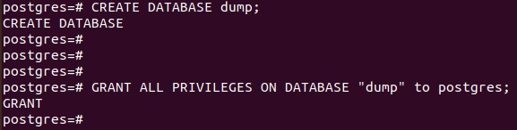

#devops-netology
##Домашнее задание к занятию "6.4. PostgreSQL"

## Задача 1

Используя docker поднимите инстанс PostgreSQL (версию 13). Данные БД сохраните в volume.
Подключитесь к БД PostgreSQL используя psql.
Воспользуйтесь командой \? 

Для вывода подсказки по имеющимся в psql управляющим командам.
Найдите и приведите управляющие команды для:

•	вывода списка БД

•	подключения к БД

•	вывода списка таблиц

•	вывода описания содержимого таблиц

•	выхода из psql

Ответ:

```bash
serge@ubu2:~$ sudo docker run --name postgres-13 -e POSTGRES_PASSWORD=postgres -d -p 5432:5432 -v /var/lib/postgres:/var/lib/postgresql/data postgres:13
ac1672a40c93cf9b1c29849503cdfb56cc39d326f1da95377a117abdc88b5218
```


```bash
serge@ubu2:~$ sudo docker ps -a
CONTAINER ID   IMAGE         COMMAND                  CREATED              STATUS              PORTS                                       NAMES
ac1672a40c93   postgres:13   "docker-entrypoint.s…"   About a minute ago   Up About a minute   0.0.0.0:5432->5432/tcp, :::5432->5432/tcp   postgres-13
```

```bash
serge@ubu2:~$ sudo docker exec -it ac1672a40c93 bash
root@ac1672a40c93:/# 
root@ac1672a40c93:/# 
root@ac1672a40c93:/# 
root@ac1672a40c93:/# psql -U postgres
psql (13.6 (Debian 13.6-1.pgdg110+1))
Type "help" for help.

postgres=# 
```


```bash
postgres=# CREATE DATABASE dump;
CREATE DATABASE
postgres=# 
```

```bash
postgres=# GRANT ALL PRIVILEGES ON DATABASE "dump" to postgres;
GRANT
postgres=# 
```


Воспользуемся командой для поиска

```bash
dump=# \?   
General
  \copyright             show PostgreSQL usage and distribution terms
  \crosstabview [COLUMNS] execute query and display results in crosstab
  \errverbose            show most recent error message at maximum verbosity
  \g [(OPTIONS)] [FILE]  execute query (and send results to file or |pipe);
                         \g with no arguments is equivalent to a semicolon
  \gdesc                 describe result of query, without executing it
  \gexec                 execute query, then execute each value in its result
  \gset [PREFIX]         execute query and store results in psql variables
  \gx [(OPTIONS)] [FILE] as \g, but forces expanded output mode
  \q                     quit psql
  \watch [SEC]           execute query every SEC seconds

Help
  \? [commands]          show help on backslash commands
  \? options             show help on psql command-line options
  \? variables           show help on special variables
  \h [NAME]              help on syntax of SQL commands, * for all commands

Query Buffer
  \e [FILE] [LINE]       edit the query buffer (or file) with external editor
  \ef [FUNCNAME [LINE]]  edit function definition with external editor
  \ev [VIEWNAME [LINE]]  edit view definition with external editor
  \p                     show the contents of the query buffer
  \r                     reset (clear) the query buffer
  \s [FILE]              display history or save it to file
...skipping 1 line
```


вывод списка БД

```bash
dump=#  \l
```


подключение к БД как пользователь postgres

```bash
root@ac1672a40c93:/# psql -U postgres
psql (13.6 (Debian 13.6-1.pgdg110+1))
Type "help" for help.
```

вывод списка таблиц 

```bash
dump=# \dt   
         List of relations
 Schema |  Name  | Type  |  Owner   
--------+--------+-------+----------
 public | orders | table | postgres
(1 row)

dump=# 
```


вывод описания списка таблиц 

```bash
\d+ myschema.mytable
```
```bash
dump=# \d+ orders;
                                                       Table "public.orders"
 Column |         Type          | Collation | Nullable |              Default         
      | Storage  | Stats target | Description 
--------+-----------------------+-----------+----------+------------------------------
------+----------+--------------+-------------
 id     | integer               |           | not null | nextval('orders_id_seq'::regc
lass) | plain    |              | 
 title  | character varying(80) |           | not null |                              
      | extended |              | 
 price  | integer               |           |          | 0                            
      | plain    |              | 
Indexes:
    "orders_pkey" PRIMARY KEY, btree (id)
Access method: heap

dump=# 
```


выход из psql 

```bash
\q
```

## Задача 2

Используя psql создайте БД test_database.

Изучите бэкап БД.

Восстановите бэкап БД в test_database.

Перейдите в управляющую консоль psql внутри контейнера.

Подключитесь к восстановленной БД и проведите операцию ANALYZE для сбора статистики по таблице.

Используя таблицу pg_stats, найдите столбец таблицы orders с наибольшим средним значением размера элементов в байтах.

Приведите в ответе команду, которую вы использовали для вычисления и полученный результат.

Ответ:

Были проблемы с восстановлением бэкапа, при именовании  БД test_database, не создавались таблицы в БД; пересоздавал контейнер не помогло,

переименовал БД в dump, ошибка пропала, и восстановление прошло без проблем.

```bash
root@ac1672a40c93:/var/lib/postgresql/data# psql -1 -U postgres dump < /var/lib/postgresql/data/test_dump.sql
SET
SET
SET
SET
SET
 set_config 
------------
 
(1 row)

SET
SET
SET
SET
SET
SET
CREATE TABLE
ALTER TABLE
CREATE SEQUENCE
ALTER TABLE
ALTER SEQUENCE
ALTER TABLE
COPY 8
 setval 
--------
      8
(1 row)

ALTER TABLE
root@ac1672a40c93:/var/lib/postgresql/data# 
```


```bash
dump=# analyze verbose orders;
INFO:  analyzing "public.orders"
INFO:  "orders": scanned 1 of 1 pages, containing 8 live rows and 0 dead rows; 8 rows in sample, 8 estimated total rows
ANALYZE
dump=# 
```


```bash
dump=# select avg_width from pg_stats where tablename='orders';
 avg_width 
-----------
         4
        16
         4
(3 rows)

dump=# 
```


## Задача 3

Архитектор и администратор БД выяснили, что ваша таблица orders разрослась до невиданных размеров и поиск по ней занимает долгое время.

Вам, как успешному выпускнику курсов DevOps в нетологии предложили провести разбиение таблицы на 2 (шардировать на orders_1 - price>499 и orders_2 - price<=499).
Предложите SQL-транзакцию для проведения данной операции.

Можно ли было изначально исключить "ручное" разбиение при проектировании таблицы orders?

Ответ:

```bash
dump=# begin;
    create table orders_new (
        id integer NOT NULL,
        title varchar(80) NOT NULL,
        price integer) partition by range(price);
    create table orders_1 partition of orders_new for values from (0) to (499);
    create table orders_2 partition of orders_new for values from (499) to (99999);
    insert into orders_new (id, title, price) select * from orders;
commit;
BEGIN
CREATE TABLE
CREATE TABLE
CREATE TABLE
INSERT 0 8
COMMIT
dump=# 
```


Изначально исключить "ручное" разбиение при проектировании таблицы можно при использовании технологии партиционирования.
Преимущества технологии будут заметны, только если исходная таблица была очень большой. В каждом конкретном случае выигрыш зависит от самого приложения. 
Эмпирическое правило гласит, что размер таблицы должен превышать размер физической памяти, выделенной под БД сервера.


## Задача 4

Используя утилиту pg_dump создайте бекап БД test_database.
Как бы вы доработали бэкап-файл, чтобы добавить уникальность значения столбца title для таблиц test_database?

Ответ:

```bash
pg_dump -U postgres dump > /var/lib/postgresql/data/new_dump.sql
```


Для определения занчения столбца title можно было бы использовать индекс, для обеспечения уникальности.