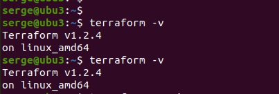
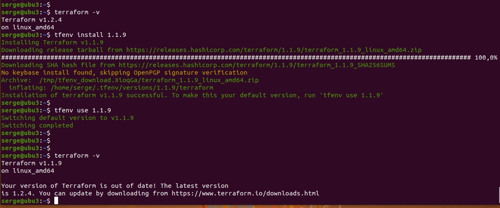

# devops-netology
## Домашнее задание к занятию "7.1. Инфраструктура как код"

## Задача 1. Выбор инструментов.

### Легенда.

Через час совещание на котором менеджер расскажет о новом проекте. Начать работу над которым надо будет уже сегодня. 
На данный момент известно, что это будет сервис, который ваша компания будет предоставлять внешним заказчикам. 
Первое время, скорее всего, будет один внешний клиент, со временем внешних клиентов станет больше.

Так же по разговорам в компании есть вероятность, что техническое задание еще не четкое, 
что приведет к большому количеству небольших релизов, тестирований интеграций, откатов, доработок, то есть скучно не будет.
Вам, как девопс инженеру, будет необходимо принять решение об инструментах для организации инфраструктуры. 
На данный момент в вашей компании уже используются следующие инструменты:

- остатки Сloud Formation,
- некоторые образы сделаны при помощи Packer,
- год назад начали активно использовать Terraform,
- разработчики привыкли использовать Docker,
- уже есть большая база Kubernetes конфигураций,
- для автоматизации процессов используется Teamcity,
- также есть совсем немного Ansible скриптов,
- и ряд bash скриптов для упрощения рутинных задач.

Для этого в рамках совещания надо будет выяснить подробности о проекте, что бы в итоге определиться с инструментами:

1. Какой тип инфраструктуры будем использовать для этого проекта: изменяемый или не изменяемый?
2. Будет ли центральный сервер для управления инфраструктурой?
3. Будут ли агенты на серверах?
4. Будут ли использованы средства для управления конфигурацией или инициализации ресурсов?

В связи с тем, что проект стартует уже сегодня, в рамках совещания надо будет определиться со всеми этими вопросами.

### В результате задачи необходимо

1. Ответить на четыре вопроса представленных в разделе "Легенда".
2. Какие инструменты из уже используемых вы хотели бы использовать для нового проекта?
3. Хотите ли рассмотреть возможность внедрения новых инструментов для этого проекта?

Если для ответа на эти вопросы недостаточно информации, то напишите какие моменты уточните на совещании.

Ответ: 

1. Для проекта будут использоваться оба типа инфраструктуры, т.к. сам проект необходимо развернуть, 
и планируются доработки и дальнейшее сопровождение проекта. 
2. Наверное, предпочтительнее, использовать инфраструктуры без центрального сервера. Это объясняется уже сложившимися инструментами,
и дополнительной точкой отказа.
3. Предпочтительнее использовать серверы без арентов. 
4. Средства управления будут использоваться для обновлений, доработки и последующего сопровождения проекта.
Логично использовать оба средства и для управления конфигурацией и для инициализации ресурсов.

- Какие инструменты из уже используемых вы хотели бы использовать для нового проекта?
- Для нового проекта предпочтительнее использовать инструменты используемые 
достаточно длительное время, и имеющие большое сообщество разработчиков, или команду в вашей компании,
что позволит использовать Terraform и Ansible в качестве главных инструментов.

- Хотите ли рассмотреть возможность внедрения новых инструментов для этого проекта?
- т.к. проект не разработан, и конечный вид неизвестен, то имеющихся инструментов разработки будет 
вполне достаточно. 


## Задача 2. Установка терраформ.

Официальный сайт: https://www.terraform.io/

Установите терраформ при помощи менеджера пакетов используемого в вашей операционной системе. 
В виде результата этой задачи приложите вывод команды   **terraform --version.**

```bash
wget -O- https://apt.releases.hashicorp.com/gpg | gpg --dearmor | sudo tee /usr/share/keyrings/hashicorp-archive-keyring.gpg
echo "deb [signed-by=/usr/share/keyrings/hashicorp-archive-keyring.gpg] https://apt.releases.hashicorp.com $(lsb_release -cs) main" | sudo tee /etc/apt/sources.list.d/hashicorp.list
sudo apt update && sudo apt install terraform
```



## Задача 3. Поддержка легаси кода.

В какой-то момент вы обновили терраформ до новой версии, например с 0.12 до 0.13. А код одного из проектов настолько устарел,
что не может работать с версией 0.13. В связи с этим необходимо сделать так, чтобы вы могли одновременно использовать 
последнюю версию терраформа установленную при помощи штатного менеджера пакетов и устаревшую версию 0.12.

В виде результата этой задачи приложите вывод  **--version**  двух версий терраформа доступных на вашем компьютере 
или виртуальной машине.

Ответ:

```bash
serge@ubu3:/usr/local/bin$ git clone https://github.com/tfutils/tfenv.git ~/.tfenv
Клонирование в «/home/serge/.tfenv»…
remote: Enumerating objects: 1569, done.
remote: Counting objects: 100% (384/384), done.
remote: Compressing objects: 100% (157/157), done.
remote: Total 1569 (delta 240), reused 336 (delta 213), pack-reused 1185
Получение объектов: 100% (1569/1569), 337.37 КиБ | 84.00 КиБ/с, готово.
Определение изменений: 100% (1003/1003), готово.
serge@ubu3:/usr/local/bin$ 
serge@ubu3:/usr/local/bin$ 
serge@ubu3:/usr/local/bin$ echo 'export PATH="$HOME/.tfenv/bin:$PATH"' >> ~/.bash_profile
serge@ubu3:/usr/local/bin$ 
serge@ubu3:/usr/local/bin$ 
serge@ubu3:/usr/local/bin$ mkdir -p ~/.local/bin/
serge@ubu3:/usr/local/bin$ cd ~
serge@ubu3:~$ . ~/.profile
serge@ubu3:~$ ln -s ~/.tfenv/bin/* ~/.local/bin
serge@ubu3:~$ which tfenv
/home/serge/.local/bin/tfenv
serge@ubu3:~$ tfenv
tfenv 2.2.3
Usage: tfenv <command> [<options>]

Commands:
   install       Install a specific version of Terraform
   use           Switch a version to use
   uninstall     Uninstall a specific version of Terraform
   list          List all installed versions
   list-remote   List all installable versions
   version-name  Print current version
   init          Update environment to use tfenv correctly.
   pin           Write the current active version to ./.terraform-version

serge@ubu3:~$ 
serge@ubu3:~$ 
serge@ubu3:~$ 
serge@ubu3:~$ tfenv list-remote
1.3.0-alpha20220622
1.3.0-alpha20220608
1.2.4
1.2.3
1.2.2
1.2.1
1.2.0
1.2.0-rc2
1.2.0-rc1
1.2.0-beta1
1.2.0-alpha20220413
1.2.0-alpha
1.1.9
1.1.8
1.1.7
1.1.6
1.1.5
1.1.4
1.1.3
1.1.2
1.1.1
1.1.0
1.1.0-rc1
1.1.0-beta2
1.1.0-beta1
1.1.0-alpha20211029
1.1.0-alpha20211020
1.1.0-alpha20211006
1.1.0-alpha20210922
1.1.0-alpha20210908
1.1.0-alpha20210811
1.1.0-alpha20210728
1.1.0-alpha20210714
1.1.0-alpha20210630
1.1.0-alpha20210616
1.0.11
1.0.10
1.0.9
1.0.8
1.0.7
1.0.6
1.0.5
1.0.4
1.0.3
1.0.2
1.0.1
1.0.0
0.15.5
0.15.4
0.15.3
0.15.2
0.15.1
0.15.0
0.15.0-rc2
0.15.0-rc1
0.15.0-beta2
0.15.0-beta1
0.15.0-alpha20210210
0.15.0-alpha20210127
0.15.0-alpha20210107
0.14.11
0.14.10
0.14.9
0.14.8
0.14.7
0.14.6
0.14.5
0.14.4
0.14.3
0.14.2
0.14.1
0.14.0
0.14.0-rc1
0.14.0-beta2
0.14.0-beta1
0.14.0-alpha20201007
0.14.0-alpha20200923
0.14.0-alpha20200910
0.13.7
0.13.6
0.13.5
0.13.4
0.13.3
0.13.2
0.13.1
0.13.0
0.13.0-rc1
0.13.0-beta3
0.13.0-beta2
0.13.0-beta1
0.12.31
0.12.30
0.12.29
0.12.28
0.12.27
0.12.26
0.12.25
0.12.24
0.12.23
0.12.22
0.12.21
0.12.20
0.12.19
0.12.18
0.12.17
0.12.16
0.12.15
0.12.14
0.12.13
0.12.12
0.12.11
0.12.10
0.12.9
0.12.8
0.12.7
0.12.6
0.12.5
0.12.4
0.12.3
0.12.2
0.12.1
0.12.0
0.12.0-rc1
0.12.0-beta2
0.12.0-beta1
0.12.0-alpha4
0.12.0-alpha3
0.12.0-alpha2
0.12.0-alpha1
0.11.15
0.11.15-oci
0.11.14
0.11.13
0.11.12
0.11.12-beta1
0.11.11
0.11.10
0.11.9
0.11.9-beta1
0.11.8
0.11.7
0.11.6
0.11.5
0.11.4
0.11.3
0.11.2
0.11.1
0.11.0
0.11.0-rc1
0.11.0-beta1
0.10.8
0.10.7
0.10.6
0.10.5
0.10.4
0.10.3
0.10.2
0.10.1
0.10.0
0.10.0-rc1
0.10.0-beta2
0.10.0-beta1
0.9.11
0.9.10
0.9.9
0.9.8
0.9.7
0.9.6
0.9.5
0.9.4
0.9.3
0.9.2
0.9.1
0.9.0
0.8.8
0.8.7
0.8.6
0.8.5
0.8.4
0.8.3
0.8.2
0.8.1
0.8.0
0.7.13
0.7.12
0.7.11
0.7.10
0.7.9
0.7.8
0.7.7
0.7.6
0.7.5
0.7.4
0.7.3
0.7.2
0.7.1
0.7.0
0.6.16
0.6.15
0.6.14
0.6.13
0.6.12
0.6.11
0.6.10
0.6.9
0.6.8
0.6.7
0.6.6
0.6.5
0.6.4
0.6.3
0.6.2
0.6.1
0.6.0
0.5.3
0.5.1
0.5.0
0.4.2
0.4.1
0.4.0
0.3.7
0.3.6
0.3.5
0.3.1
0.3.0
0.2.2
0.2.1
0.2.0
0.1.1
0.1.0
serge@ubu3:~$ tfenv install 1.2.4
Installing Terraform v1.2.4
Downloading release tarball from https://releases.hashicorp.com/terraform/1.2.4/terraform_1.2.4_linux_amd64.zip
############################################################################################################################ 100,0%
Downloading SHA hash file from https://releases.hashicorp.com/terraform/1.2.4/terraform_1.2.4_SHA256SUMS
No keybase install found, skipping OpenPGP signature verification
Archive:  /tmp/tfenv_download.AqWKZ2/terraform_1.2.4_linux_amd64.zip
  inflating: /home/serge/.tfenv/versions/1.2.4/terraform  
Installation of terraform v1.2.4 successful. To make this your default version, run 'tfenv use 1.2.4'
serge@ubu3:~$ 
serge@ubu3:~$ 
serge@ubu3:~$ 
serge@ubu3:~$ 
serge@ubu3:~$ tfenv use 1.2.4
Switching default version to v1.2.4
Switching completed
serge@ubu3:~$ 
serge@ubu3:~$ 
serge@ubu3:~$ 
serge@ubu3:~$ terraform -v
Terraform v1.2.4
on linux_amd64
serge@ubu3:~$ tfenv install 1.1.9
Installing Terraform v1.1.9
Downloading release tarball from https://releases.hashicorp.com/terraform/1.1.9/terraform_1.1.9_linux_amd64.zip
############################################################################################################################ 100,0%
Downloading SHA hash file from https://releases.hashicorp.com/terraform/1.1.9/terraform_1.1.9_SHA256SUMS
No keybase install found, skipping OpenPGP signature verification
Archive:  /tmp/tfenv_download.XioqGa/terraform_1.1.9_linux_amd64.zip
  inflating: /home/serge/.tfenv/versions/1.1.9/terraform  
Installation of terraform v1.1.9 successful. To make this your default version, run 'tfenv use 1.1.9'
serge@ubu3:~$ 
serge@ubu3:~$ tfenv use 1.1.9
Switching default version to v1.1.9
Switching completed
serge@ubu3:~$ 
serge@ubu3:~$ 
serge@ubu3:~$ 
serge@ubu3:~$ terraform -v
Terraform v1.1.9
on linux_amd64

Your version of Terraform is out of date! The latest version
is 1.2.4. You can update by downloading from https://www.terraform.io/downloads.html
serge@ubu3:~$ 
```

