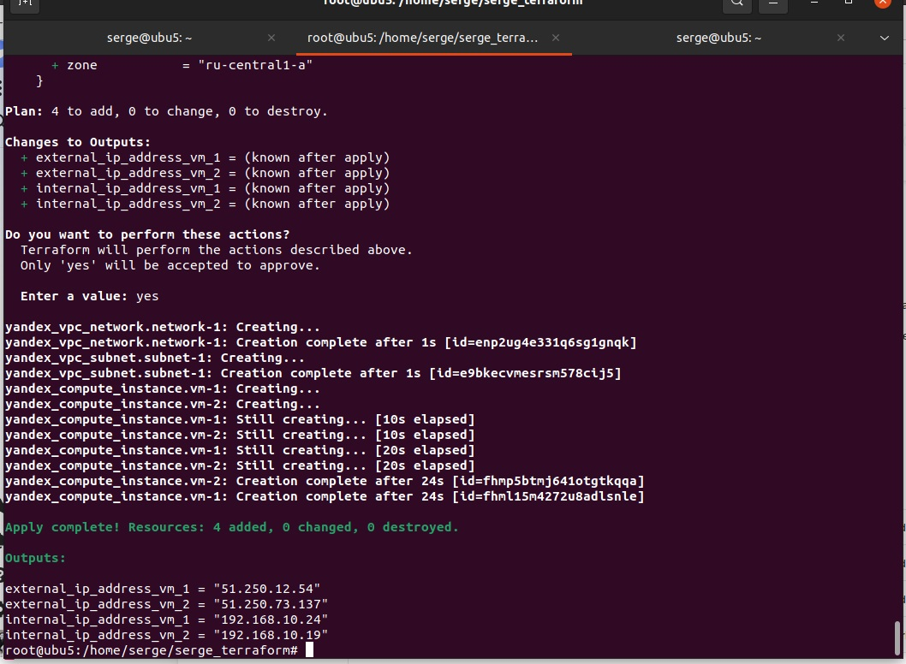

# devops-netology
## Домашнее задание к занятию "7.2. Облачные провайдеры и синтаксис Terraform."

## Задача 2. 

Ответ:

Ответ: Применительно к YandexCloud - можно создавать образы при помощи packer.

```bash
root@ubu5:/home/serge/serge_terraform# 
root@ubu5:/home/serge/serge_terraform# 
root@ubu5:/home/serge/serge_terraform# terraform init

Initializing the backend...

Initializing provider plugins...
- Finding yandex-cloud/yandex versions matching "0.73.0"...
- Installing yandex-cloud/yandex v0.73.0...
- Installed yandex-cloud/yandex v0.73.0 (self-signed, key ID E40F590B50BB8E40)

Partner and community providers are signed by their developers.
If you'd like to know more about provider signing, you can read about it here:
https://www.terraform.io/docs/cli/plugins/signing.html

Terraform has created a lock file .terraform.lock.hcl to record the provider
selections it made above. Include this file in your version control repository
so that Terraform can guarantee to make the same selections by default when
you run "terraform init" in the future.

Terraform has been successfully initialized!

You may now begin working with Terraform. Try running "terraform plan" to see
any changes that are required for your infrastructure. All Terraform commands
should now work.

If you ever set or change modules or backend configuration for Terraform,
rerun this command to reinitialize your working directory. If you forget, other
commands will detect it and remind you to do so if necessary.
root@ubu5:/home/serge/serge_terraform# 
root@ubu5:/home/serge/serge_terraform# 
```

```bash
root@ubu5:/home/serge/serge_terraform# 
root@ubu5:/home/serge/serge_terraform# 
root@ubu5:/home/serge/serge_terraform# ll
итого 36
drwxr-xr-x  3 root  root  4096 июл 11 21:46 ./
drwxr-x--- 20 serge serge 4096 июл 11 15:20 ../
-rw-r--r--  1 root  root  1549 июл 11 18:07 infrastructure1.tf
-rw-r--r--  1 root  root   315 июл 11 19:48 main.tf
-rw-r--r--  1 root  root   698 июл 11 16:25 meta.yml
-rw-r--r--  1 root  root   444 июл 11 21:46 outputs.tf
drwxr-xr-x  3 root  root  4096 июл 11 15:42 .terraform/
-rw-r--r--  1 root  root  1262 июл 11 15:42 .terraform.lock.hcl
-rw-r--r--  1 root  root   277 июл 11 20:15 variables.tf
root@ubu5:/home/serge/serge_terraform# nano infrastructure1.tf
root@ubu5:/home/serge/serge_terraform# 
root@ubu5:/home/serge/serge_terraform# 
root@ubu5:/home/serge/serge_terraform# terraform validate
Success! The configuration is valid.

root@ubu5:/home/serge/serge_terraform# terraform plan
data.yandex_compute_image.ubuntu_image: Reading...
data.yandex_compute_image.ubuntu_image: Read complete after 0s [id=fd8qs44945ddtla09hnr]

Terraform used the selected providers to generate the following execution plan. Resource actions are indicated
with the following symbols:
  + create

Terraform will perform the following actions:

  # yandex_compute_instance.vm-1 will be created
  + resource "yandex_compute_instance" "vm-1" {
      + created_at                = (known after apply)
      + folder_id                 = (known after apply)
      + fqdn                      = (known after apply)
      + hostname                  = (known after apply)
      + id                        = (known after apply)
      + metadata                  = {
          + "user-data" = <<-EOT
                #cloud-config
                users:
                  - name: serge
                    groups: sudo
                    shell: /bin/bash
                    sudo: ['ALL=(ALL) NOPASSWD:ALL']
                    ssh-authorized-keys:
                      - ssh-rsa AAAAB3NzaC1yc2EAAAADAQABAAABgQCpjNCGKUk5Poca1C4+QMWTyJFdlJoSnndTE96TovZ8FCRwjH8QGPZ7YJV2V9hTNxBvHN7A40hES+l6XZxwipmWfYBsAenY09BVfWwhAPkxeqypL4wh/c678hx4x5n3cFw7yP5O5PuADlCWv3z0h/ZTE4m4p6Zm00YnU5MVDgl+zmFQzeTKElhUbCUm88Bg6OpIBbB9aoEZMiOyqKo6a1gGzRu2ofBJxMdtOOUs3e5F7k2mGcc9+8khpiyT4zJjJ/xVu2BvchTar3gJAjCC48FMwuyxFjq3P6Xcjuh3ZadBiqu0ssYseayPzA4WURRtIt4D3+GPqCZoioLVwf9vSTSBXEWkSZbFJitxgEJOkPMbhC+vpBiYJlhPZi1ny/8sCBel6mU2ijcajwFyqxw2XO2I4Wh0T4sJbSxevD+LSLHaX5oXfj8dYPKVKObk7lsLMFJuvzvidSPsZrN2+pzipJibO0Qx5OPOykR6t14PhEpSWkqMo6bMqEzRS9RvL6F+A5k=
            EOT
        }
      + name                      = "terraform1"
      + network_acceleration_type = "standard"
      + platform_id               = "standard-v1"
      + service_account_id        = (known after apply)
      + status                    = (known after apply)
      + zone                      = (known after apply)

      + boot_disk {
          + auto_delete = true
          + device_name = (known after apply)
          + disk_id     = (known after apply)
          + mode        = (known after apply)

          + initialize_params {
              + block_size  = (known after apply)
              + description = (known after apply)
              + image_id    = "fd8qs44945ddtla09hnr"
              + name        = (known after apply)
              + size        = (known after apply)
              + snapshot_id = (known after apply)
              + type        = "network-hdd"
            }
        }

      + network_interface {
          + index              = (known after apply)
          + ip_address         = (known after apply)
          + ipv4               = true
          + ipv6               = (known after apply)
          + ipv6_address       = (known after apply)
          + mac_address        = (known after apply)
          + nat                = true
          + nat_ip_address     = (known after apply)
          + nat_ip_version     = (known after apply)
          + security_group_ids = (known after apply)
          + subnet_id          = (known after apply)
        }

      + placement_policy {
          + host_affinity_rules = (known after apply)
          + placement_group_id  = (known after apply)
        }

      + resources {
          + core_fraction = 100
          + cores         = 2
          + memory        = 2
        }

      + scheduling_policy {
          + preemptible = (known after apply)
        }
    }

  # yandex_compute_instance.vm-2 will be created
  + resource "yandex_compute_instance" "vm-2" {
      + created_at                = (known after apply)
      + folder_id                 = (known after apply)
      + fqdn                      = (known after apply)
      + hostname                  = (known after apply)
      + id                        = (known after apply)
      + metadata                  = {
          + "user-data" = <<-EOT
                #cloud-config
                users:
                  - name: serge
                    groups: sudo
                    shell: /bin/bash
                    sudo: ['ALL=(ALL) NOPASSWD:ALL']
                    ssh-authorized-keys:
                      - ssh-rsa AAAAB3NzaC1yc2EAAAADAQABAAABgQCpjNCGKUk5Poca1C4+QMWTyJFdlJoSnndTE96TovZ8FCRwjH8QGPZ7YJV2V9hTNxBvHN7A40hES+l6XZxwipmWfYBsAenY09BVfWwhAPkxeqypL4wh/c678hx4x5n3cFw7yP5O5PuADlCWv3z0h/ZTE4m4p6Zm00YnU5MVDgl+zmFQzeTKElhUbCUm88Bg6OpIBbB9aoEZMiOyqKo6a1gGzRu2ofBJxMdtOOUs3e5F7k2mGcc9+8khpiyT4zJjJ/xVu2BvchTar3gJAjCC48FMwuyxFjq3P6Xcjuh3ZadBiqu0ssYseayPzA4WURRtIt4D3+GPqCZoioLVwf9vSTSBXEWkSZbFJitxgEJOkPMbhC+vpBiYJlhPZi1ny/8sCBel6mU2ijcajwFyqxw2XO2I4Wh0T4sJbSxevD+LSLHaX5oXfj8dYPKVKObk7lsLMFJuvzvidSPsZrN2+pzipJibO0Qx5OPOykR6t14PhEpSWkqMo6bMqEzRS9RvL6F+A5k=
            EOT
        }
      + name                      = "terraform2"
      + network_acceleration_type = "standard"
      + platform_id               = "standard-v1"
      + service_account_id        = (known after apply)
      + status                    = (known after apply)
      + zone                      = (known after apply)

      + boot_disk {
          + auto_delete = true
          + device_name = (known after apply)
          + disk_id     = (known after apply)
          + mode        = (known after apply)

          + initialize_params {
              + block_size  = (known after apply)
              + description = (known after apply)
              + image_id    = "fd8qs44945ddtla09hnr"
              + name        = (known after apply)
              + size        = (known after apply)
              + snapshot_id = (known after apply)
              + type        = "network-hdd"
            }
        }

      + network_interface {
          + index              = (known after apply)
          + ip_address         = (known after apply)
          + ipv4               = true
          + ipv6               = (known after apply)
          + ipv6_address       = (known after apply)
          + mac_address        = (known after apply)
          + nat                = true
          + nat_ip_address     = (known after apply)
          + nat_ip_version     = (known after apply)
          + security_group_ids = (known after apply)
          + subnet_id          = (known after apply)
        }

      + placement_policy {
          + host_affinity_rules = (known after apply)
          + placement_group_id  = (known after apply)
        }

      + resources {
          + core_fraction = 100
          + cores         = 4
          + memory        = 4
        }

      + scheduling_policy {
          + preemptible = (known after apply)
        }
    }

  # yandex_vpc_network.network-1 will be created
  + resource "yandex_vpc_network" "network-1" {
      + created_at                = (known after apply)
      + default_security_group_id = (known after apply)
      + folder_id                 = (known after apply)
      + id                        = (known after apply)
      + labels                    = (known after apply)
      + name                      = "network1"
      + subnet_ids                = (known after apply)
    }

  # yandex_vpc_subnet.subnet-1 will be created
  + resource "yandex_vpc_subnet" "subnet-1" {
      + created_at     = (known after apply)
      + folder_id      = (known after apply)
      + id             = (known after apply)
      + labels         = (known after apply)
      + name           = "subnet1"
      + network_id     = (known after apply)
      + v4_cidr_blocks = [
          + "192.168.10.0/24",
        ]
      + v6_cidr_blocks = (known after apply)
      + zone           = "ru-central1-a"
    }

Plan: 4 to add, 0 to change, 0 to destroy.

Changes to Outputs:
  + external_ip_address_vm_1 = (known after apply)
  + external_ip_address_vm_2 = (known after apply)
  + internal_ip_address_vm_1 = (known after apply)
  + internal_ip_address_vm_2 = (known after apply)

──────────────────────────────────────────────────────────────────────────────────────────────────────────────────

Note: You didn't use the -out option to save this plan, so Terraform can't guarantee to take exactly these actions
if you run "terraform apply" now.
root@ubu5:/home/serge/serge_terraform# terraform apply
data.yandex_compute_image.ubuntu_image: Reading...
data.yandex_compute_image.ubuntu_image: Read complete after 0s [id=fd8qs44945ddtla09hnr]

Terraform used the selected providers to generate the following execution plan. Resource actions are indicated
with the following symbols:
  + create

Terraform will perform the following actions:

  # yandex_compute_instance.vm-1 will be created
  + resource "yandex_compute_instance" "vm-1" {
      + created_at                = (known after apply)
      + folder_id                 = (known after apply)
      + fqdn                      = (known after apply)
      + hostname                  = (known after apply)
      + id                        = (known after apply)
      + metadata                  = {
          + "user-data" = <<-EOT
                #cloud-config
                users:
                  - name: serge
                    groups: sudo
                    shell: /bin/bash
                    sudo: ['ALL=(ALL) NOPASSWD:ALL']
                    ssh-authorized-keys:
                      - ssh-rsa AAAAB3NzaC1yc2EAAAADAQABAAABgQCpjNCGKUk5Poca1C4+QMWTyJFdlJoSnndTE96TovZ8FCRwjH8QGPZ7YJV2V9hTNxBvHN7A40hES+l6XZxwipmWfYBsAenY09BVfWwhAPkxeqypL4wh/c678hx4x5n3cFw7yP5O5PuADlCWv3z0h/ZTE4m4p6Zm00YnU5MVDgl+zmFQzeTKElhUbCUm88Bg6OpIBbB9aoEZMiOyqKo6a1gGzRu2ofBJxMdtOOUs3e5F7k2mGcc9+8khpiyT4zJjJ/xVu2BvchTar3gJAjCC48FMwuyxFjq3P6Xcjuh3ZadBiqu0ssYseayPzA4WURRtIt4D3+GPqCZoioLVwf9vSTSBXEWkSZbFJitxgEJOkPMbhC+vpBiYJlhPZi1ny/8sCBel6mU2ijcajwFyqxw2XO2I4Wh0T4sJbSxevD+LSLHaX5oXfj8dYPKVKObk7lsLMFJuvzvidSPsZrN2+pzipJibO0Qx5OPOykR6t14PhEpSWkqMo6bMqEzRS9RvL6F+A5k=
            EOT
        }
      + name                      = "terraform1"
      + network_acceleration_type = "standard"
      + platform_id               = "standard-v1"
      + service_account_id        = (known after apply)
      + status                    = (known after apply)
      + zone                      = (known after apply)

      + boot_disk {
          + auto_delete = true
          + device_name = (known after apply)
          + disk_id     = (known after apply)
          + mode        = (known after apply)

          + initialize_params {
              + block_size  = (known after apply)
              + description = (known after apply)
              + image_id    = "fd8qs44945ddtla09hnr"
              + name        = (known after apply)
              + size        = (known after apply)
              + snapshot_id = (known after apply)
              + type        = "network-hdd"
            }
        }

      + network_interface {
          + index              = (known after apply)
          + ip_address         = (known after apply)
          + ipv4               = true
          + ipv6               = (known after apply)
          + ipv6_address       = (known after apply)
          + mac_address        = (known after apply)
          + nat                = true
          + nat_ip_address     = (known after apply)
          + nat_ip_version     = (known after apply)
          + security_group_ids = (known after apply)
          + subnet_id          = (known after apply)
        }

      + placement_policy {
          + host_affinity_rules = (known after apply)
          + placement_group_id  = (known after apply)
        }

      + resources {
          + core_fraction = 100
          + cores         = 2
          + memory        = 2
        }

      + scheduling_policy {
          + preemptible = (known after apply)
        }
    }

  # yandex_compute_instance.vm-2 will be created
  + resource "yandex_compute_instance" "vm-2" {
      + created_at                = (known after apply)
      + folder_id                 = (known after apply)
      + fqdn                      = (known after apply)
      + hostname                  = (known after apply)
      + id                        = (known after apply)
      + metadata                  = {
          + "user-data" = <<-EOT
                #cloud-config
                users:
                  - name: serge
                    groups: sudo
                    shell: /bin/bash
                    sudo: ['ALL=(ALL) NOPASSWD:ALL']
                    ssh-authorized-keys:
                      - ssh-rsa AAAAB3NzaC1yc2EAAAADAQABAAABgQCpjNCGKUk5Poca1C4+QMWTyJFdlJoSnndTE96TovZ8FCRwjH8QGPZ7YJV2V9hTNxBvHN7A40hES+l6XZxwipmWfYBsAenY09BVfWwhAPkxeqypL4wh/c678hx4x5n3cFw7yP5O5PuADlCWv3z0h/ZTE4m4p6Zm00YnU5MVDgl+zmFQzeTKElhUbCUm88Bg6OpIBbB9aoEZMiOyqKo6a1gGzRu2ofBJxMdtOOUs3e5F7k2mGcc9+8khpiyT4zJjJ/xVu2BvchTar3gJAjCC48FMwuyxFjq3P6Xcjuh3ZadBiqu0ssYseayPzA4WURRtIt4D3+GPqCZoioLVwf9vSTSBXEWkSZbFJitxgEJOkPMbhC+vpBiYJlhPZi1ny/8sCBel6mU2ijcajwFyqxw2XO2I4Wh0T4sJbSxevD+LSLHaX5oXfj8dYPKVKObk7lsLMFJuvzvidSPsZrN2+pzipJibO0Qx5OPOykR6t14PhEpSWkqMo6bMqEzRS9RvL6F+A5k=
            EOT
        }
      + name                      = "terraform2"
      + network_acceleration_type = "standard"
      + platform_id               = "standard-v1"
      + service_account_id        = (known after apply)
      + status                    = (known after apply)
      + zone                      = (known after apply)

      + boot_disk {
          + auto_delete = true
          + device_name = (known after apply)
          + disk_id     = (known after apply)
          + mode        = (known after apply)

          + initialize_params {
              + block_size  = (known after apply)
              + description = (known after apply)
              + image_id    = "fd8qs44945ddtla09hnr"
              + name        = (known after apply)
              + size        = (known after apply)
              + snapshot_id = (known after apply)
              + type        = "network-hdd"
            }
        }

      + network_interface {
          + index              = (known after apply)
          + ip_address         = (known after apply)
          + ipv4               = true
          + ipv6               = (known after apply)
          + ipv6_address       = (known after apply)
          + mac_address        = (known after apply)
          + nat                = true
          + nat_ip_address     = (known after apply)
          + nat_ip_version     = (known after apply)
          + security_group_ids = (known after apply)
          + subnet_id          = (known after apply)
        }

      + placement_policy {
          + host_affinity_rules = (known after apply)
          + placement_group_id  = (known after apply)
        }

      + resources {
          + core_fraction = 100
          + cores         = 4
          + memory        = 4
        }

      + scheduling_policy {
          + preemptible = (known after apply)
        }
    }

  # yandex_vpc_network.network-1 will be created
  + resource "yandex_vpc_network" "network-1" {
      + created_at                = (known after apply)
      + default_security_group_id = (known after apply)
      + folder_id                 = (known after apply)
      + id                        = (known after apply)
      + labels                    = (known after apply)
      + name                      = "network1"
      + subnet_ids                = (known after apply)
    }

  # yandex_vpc_subnet.subnet-1 will be created
  + resource "yandex_vpc_subnet" "subnet-1" {
      + created_at     = (known after apply)
      + folder_id      = (known after apply)
      + id             = (known after apply)
      + labels         = (known after apply)
      + name           = "subnet1"
      + network_id     = (known after apply)
      + v4_cidr_blocks = [
          + "192.168.10.0/24",
        ]
      + v6_cidr_blocks = (known after apply)
      + zone           = "ru-central1-a"
    }

Plan: 4 to add, 0 to change, 0 to destroy.

Changes to Outputs:
  + external_ip_address_vm_1 = (known after apply)
  + external_ip_address_vm_2 = (known after apply)
  + internal_ip_address_vm_1 = (known after apply)
  + internal_ip_address_vm_2 = (known after apply)

Do you want to perform these actions?
  Terraform will perform the actions described above.
  Only 'yes' will be accepted to approve.

  Enter a value: yes

yandex_vpc_network.network-1: Creating...
yandex_vpc_network.network-1: Creation complete after 1s [id=enp2ug4e331q6sg1gnqk]
yandex_vpc_subnet.subnet-1: Creating...
yandex_vpc_subnet.subnet-1: Creation complete after 1s [id=e9bkecvmesrsm578cij5]
yandex_compute_instance.vm-1: Creating...
yandex_compute_instance.vm-2: Creating...
yandex_compute_instance.vm-1: Still creating... [10s elapsed]
yandex_compute_instance.vm-2: Still creating... [10s elapsed]
yandex_compute_instance.vm-1: Still creating... [20s elapsed]
yandex_compute_instance.vm-2: Still creating... [20s elapsed]
yandex_compute_instance.vm-2: Creation complete after 24s [id=fhmp5btmj641otgtkqqa]
yandex_compute_instance.vm-1: Creation complete after 24s [id=fhml15m4272u8adlsnle]

Apply complete! Resources: 4 added, 0 changed, 0 destroyed.

Outputs:

external_ip_address_vm_1 = "51.250.12.54"
external_ip_address_vm_2 = "51.250.73.137"
internal_ip_address_vm_1 = "192.168.10.24"
internal_ip_address_vm_2 = "192.168.10.19"
root@ubu5:/home/serge/serge_terraform# 
root@ubu5:/home/serge/serge_terraform# 
root@ubu5:/home/serge/serge_terraform# 
root@ubu5:/home/serge/serge_terraform# serge@51.250.12.54
serge@51.250.12.54: команда не найдена
root@ubu5:/home/serge/serge_terraform# serge@192.168.10.24
serge@192.168.10.24: команда не найдена
root@ubu5:/home/serge/serge_terraform# ssh serge@51.250.12.54
The authenticity of host '51.250.12.54 (51.250.12.54)' can't be established.
ECDSA key fingerprint is SHA256:xx7wLIDDHrhPgtxsKdGRwqbTi571d1NgVPngkqaKnxs.
Are you sure you want to continue connecting (yes/no/[fingerprint])? yes
Warning: Permanently added '51.250.12.54' (ECDSA) to the list of known hosts.
Welcome to Ubuntu 20.04.4 LTS (GNU/Linux 5.4.0-121-generic x86_64)

 * Documentation:  https://help.ubuntu.com
 * Management:     https://landscape.canonical.com
 * Support:        https://ubuntu.com/advantage

The programs included with the Ubuntu system are free software;
the exact distribution terms for each program are described in the
individual files in /usr/share/doc/*/copyright.

Ubuntu comes with ABSOLUTELY NO WARRANTY, to the extent permitted by
applicable law.

To run a command as administrator (user "root"), use "sudo <command>".
See "man sudo_root" for details.

serge@fhml15m4272u8adlsnle:~$ 
serge@fhml15m4272u8adlsnle:~$ 
serge@fhml15m4272u8adlsnle:~$ 
serge@fhml15m4272u8adlsnle:~$ ll
total 28
drwxr-xr-x 4 serge serge 4096 Jul 11 19:11 ./
drwxr-xr-x 3 root  root  4096 Jul 11 18:56 ../
-rw-r--r-- 1 serge serge  220 Feb 25  2020 .bash_logout
-rw-r--r-- 1 serge serge 3771 Feb 25  2020 .bashrc
drwx------ 2 serge serge 4096 Jul 11 19:11 .cache/
-rw-r--r-- 1 serge serge  807 Feb 25  2020 .profile
drwx------ 2 serge serge 4096 Jul 11 18:56 .ssh/
serge@fhml15m4272u8adlsnle:~$ exit
logout
Connection to 51.250.12.54 closed.
root@ubu5:/home/serge/serge_terraform# 
root@ubu5:/home/serge/serge_terraform# 
root@ubu5:/home/serge/serge_terraform# 
root@ubu5:/home/serge/serge_terraform# ll
итого 48
drwxr-xr-x  3 root  root   4096 июл 11 21:55 ./
drwxr-x--- 20 serge serge  4096 июл 11 15:20 ../
-rw-r--r--  1 root  root   1106 июл 11 21:50 infrastructure1.tf
-rw-r--r--  1 root  root    315 июл 11 19:48 main.tf
-rw-r--r--  1 root  root    698 июл 11 16:25 meta.yml
-rw-r--r--  1 root  root    444 июл 11 21:46 outputs.tf
drwxr-xr-x  3 root  root   4096 июл 11 15:42 .terraform/
-rw-r--r--  1 root  root   1262 июл 11 15:42 .terraform.lock.hcl
-rw-r--r--  1 root  root  11161 июл 11 21:55 terraform.tfstate
-rw-r--r--  1 root  root    277 июл 11 20:15 variables.tf
root@ubu5:/home/serge/serge_terraform# 

```




