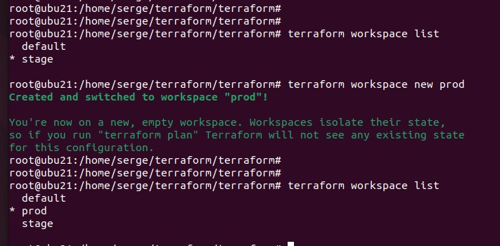
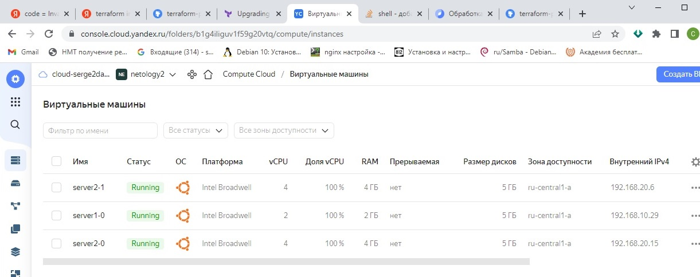
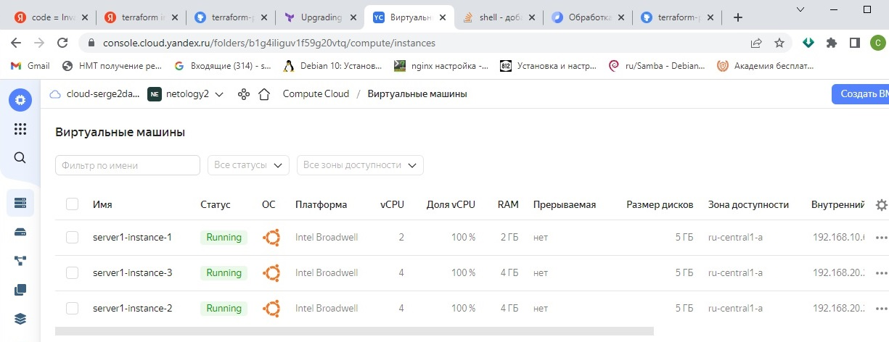
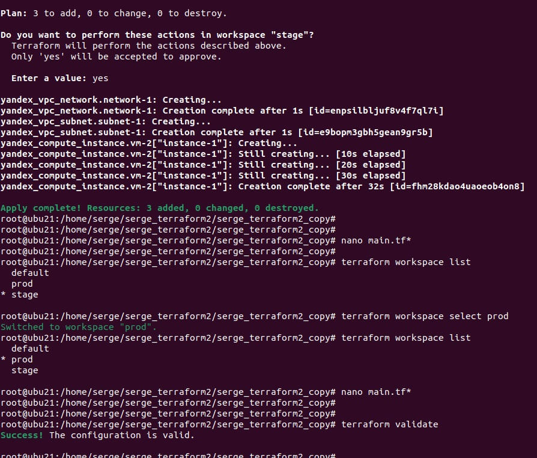

# devops-netology
## Домашнее задание к занятию "7.3. Основы и принцип работы Терраформ"

## Задача 2. Инициализируем проект и создаем воркспейсы.

1. Выполните ```terraform init```:
если был создан бэкэнд в S3, то терраформ создат файл стейтов в S3 и запись в таблице dynamodb.
иначе будет создан локальный файл со стейтами.
2. Создайте два воркспейса ```stage``` и ```prod```.
3. В уже созданный ```aws_instance``` добавьте зависимость типа инстанса от вокспейса,
что бы в разных ворскспейсах использовались разные ```instance_type```.
4. Добавим ```count```. Для ```stage``` должен создаться один экземпляр ```ec2```, а для ```prod``` два.
5. Создайте рядом еще один ```aws_instance```, но теперь определите их количество при помощи ```for_each```, а не ```count```.
6. Что бы при изменении типа инстанса не возникло ситуации, когда не будет ни одного инстанса 
добавьте параметр жизненного цикла ```create_before_destroy = true``` в один из рессурсов ```aws_instance```.
7. При желании поэкспериментируйте с другими параметрами и рессурсами.

В виде результата работы пришлите:
* Вывод команды ```terraform workspace list```.
* Вывод команды ```terraform plan``` для воркспейса ```prod```.

Ответ:

```bash
root@ubu21:/home/serge/serge_terraform2/serge_terraform2_copy# terraform workspace list
  default
* prod
  stage
```


```bash
root@ubu21:/home/serge/serge_terraform2/serge_terraform2_copy# terraform plan

Terraform used the selected providers to generate the following execution plan. Resource actions are indicated with
the following symbols:
  + create

Terraform will perform the following actions:

  # yandex_compute_instance.vm-1[0] will be created
  + resource "yandex_compute_instance" "vm-1" {
      + created_at                = (known after apply)
      + folder_id                 = (known after apply)
      + fqdn                      = (known after apply)
      + hostname                  = (known after apply)
      + id                        = (known after apply)
      + metadata                  = {
          + "user-data" = <<-EOT
                #cloud-config
                users:
                  - name: serge
                    groups: sudo
                    shell: /bin/bash
                    sudo: ['ALL=(ALL) NOPASSWD:ALL']
                    ssh-authorized-keys:
                      - ssh-rsa AAAAB3NzaC1yc2EAAAADAQABAAABgQCpjNCGKUk5Poca1C4+QMWTyJFdlJoSnndTE96TovZ8FCRwjH8QGPZ7YJV2V9hTNxBvHN7A40hES+l6XZxwipmWfYBsAenY09BVfWwhAPkxeqypL4wh/c678hx4x5n3cFw7yP5O5PuADlCWv3z0h/ZTE4m4p6Zm00YnU5MVDgl+zmFQzeTKElhUbCUm88Bg6OpIBbB9aoEZMiOyqKo6a1gGzRu2ofBJxMdtOOUs3e5F7k2mGcc9+8khpiyT4zJjJ/xVu2BvchTar3gJAjCC48FMwuyxFjq3P6Xcjuh3ZadBiqu0ssYseayPzA4WURRtIt4D3+GPqCZoioLVwf9vSTSBXEWkSZbFJitxgEJOkPMbhC+vpBiYJlhPZi1ny/8sCBel6mU2ijcajwFyqxw2XO2I4Wh0T4sJbSxevD+LSLHaX5oXfj8dYPKVKObk7lsLMFJuvzvidSPsZrN2+pzipJibO0Qx5OPOykR6t14PhEpSWkqMo6bMqEzRS9RvL6F+A5k=
            EOT
        }
      + name                      = "server2-0"
      + network_acceleration_type = "standard"
      + platform_id               = "standard-v1"
      + service_account_id        = (known after apply)
      + status                    = (known after apply)
      + zone                      = (known after apply)

      + boot_disk {
          + auto_delete = true
          + device_name = (known after apply)
          + disk_id     = (known after apply)
          + mode        = (known after apply)

          + initialize_params {
              + block_size  = (known after apply)
              + description = (known after apply)
              + image_id    = "fd8kdq6d0p8sij7h5qe3"
              + name        = (known after apply)
              + size        = (known after apply)
              + snapshot_id = (known after apply)
              + type        = "network-hdd"
            }
        }

      + network_interface {
          + index              = (known after apply)
          + ip_address         = (known after apply)
          + ipv4               = true
          + ipv6               = (known after apply)
          + ipv6_address       = (known after apply)
          + mac_address        = (known after apply)
          + nat                = true
          + nat_ip_address     = (known after apply)
          + nat_ip_version     = (known after apply)
          + security_group_ids = (known after apply)
          + subnet_id          = (known after apply)
        }

      + placement_policy {
          + host_affinity_rules = (known after apply)
          + placement_group_id  = (known after apply)
        }

      + resources {
          + core_fraction = 100
          + cores         = 4
          + memory        = 4
        }

      + scheduling_policy {
          + preemptible = (known after apply)
        }
    }

  # yandex_compute_instance.vm-1[1] will be created
  + resource "yandex_compute_instance" "vm-1" {
      + created_at                = (known after apply)
      + folder_id                 = (known after apply)
      + fqdn                      = (known after apply)
      + hostname                  = (known after apply)
      + id                        = (known after apply)
      + metadata                  = {
          + "user-data" = <<-EOT
                #cloud-config
                users:
                  - name: serge
                    groups: sudo
                    shell: /bin/bash
                    sudo: ['ALL=(ALL) NOPASSWD:ALL']
                    ssh-authorized-keys:
                      - ssh-rsa AAAAB3NzaC1yc2EAAAADAQABAAABgQCpjNCGKUk5Poca1C4+QMWTyJFdlJoSnndTE96TovZ8FCRwjH8QGPZ7YJV2V9hTNxBvHN7A40hES+l6XZxwipmWfYBsAenY09BVfWwhAPkxeqypL4wh/c678hx4x5n3cFw7yP5O5PuADlCWv3z0h/ZTE4m4p6Zm00YnU5MVDgl+zmFQzeTKElhUbCUm88Bg6OpIBbB9aoEZMiOyqKo6a1gGzRu2ofBJxMdtOOUs3e5F7k2mGcc9+8khpiyT4zJjJ/xVu2BvchTar3gJAjCC48FMwuyxFjq3P6Xcjuh3ZadBiqu0ssYseayPzA4WURRtIt4D3+GPqCZoioLVwf9vSTSBXEWkSZbFJitxgEJOkPMbhC+vpBiYJlhPZi1ny/8sCBel6mU2ijcajwFyqxw2XO2I4Wh0T4sJbSxevD+LSLHaX5oXfj8dYPKVKObk7lsLMFJuvzvidSPsZrN2+pzipJibO0Qx5OPOykR6t14PhEpSWkqMo6bMqEzRS9RvL6F+A5k=
            EOT
        }
      + name                      = "server2-1"
      + network_acceleration_type = "standard"
      + platform_id               = "standard-v1"
      + service_account_id        = (known after apply)
      + status                    = (known after apply)
      + zone                      = (known after apply)

      + boot_disk {
          + auto_delete = true
          + device_name = (known after apply)
          + disk_id     = (known after apply)
          + mode        = (known after apply)

          + initialize_params {
              + block_size  = (known after apply)
              + description = (known after apply)
              + image_id    = "fd8kdq6d0p8sij7h5qe3"
              + name        = (known after apply)
              + size        = (known after apply)
              + snapshot_id = (known after apply)
              + type        = "network-hdd"
            }
        }

      + network_interface {
          + index              = (known after apply)
          + ip_address         = (known after apply)
          + ipv4               = true
          + ipv6               = (known after apply)
          + ipv6_address       = (known after apply)
          + mac_address        = (known after apply)
          + nat                = true
          + nat_ip_address     = (known after apply)
          + nat_ip_version     = (known after apply)
          + security_group_ids = (known after apply)
          + subnet_id          = (known after apply)
        }

      + placement_policy {
          + host_affinity_rules = (known after apply)
          + placement_group_id  = (known after apply)
        }

      + resources {
          + core_fraction = 100
          + cores         = 4
          + memory        = 4
        }

      + scheduling_policy {
          + preemptible = (known after apply)
        }
    }

  # yandex_vpc_network.network-2 will be created
  + resource "yandex_vpc_network" "network-2" {
      + created_at                = (known after apply)
      + default_security_group_id = (known after apply)
      + folder_id                 = (known after apply)
      + id                        = (known after apply)
      + labels                    = (known after apply)
      + name                      = "network2"
      + subnet_ids                = (known after apply)
    }

  # yandex_vpc_subnet.subnet-2 will be created
  + resource "yandex_vpc_subnet" "subnet-2" {
      + created_at     = (known after apply)
      + folder_id      = (known after apply)
      + id             = (known after apply)
      + labels         = (known after apply)
      + name           = "subnet2"
      + network_id     = (known after apply)
      + v4_cidr_blocks = [
          + "192.168.20.0/24",
        ]
      + v6_cidr_blocks = (known after apply)
      + zone           = "ru-central1-a"
    }

Plan: 4 to add, 0 to change, 0 to destroy.

──────────────────────────────────────────────────────────────────────────────────────────────────────────────────────

Note: You didn't use the -out option to save this plan, so Terraform can't guarantee to take exactly these actions if
you run "terraform apply" now.
```



```bash
root@ubu21:/home/serge/serge_terraform2/serge_terraform2_copy# terraform validate
Success! The configuration is valid.

root@ubu21:/home/serge/serge_terraform2/serge_terraform2_copy# terraform plan

Terraform used the selected providers to generate the following execution plan. Resource actions are indicated with
the following symbols:
  + create

Terraform will perform the following actions:

  # yandex_compute_instance.vm-2["instance-2"] will be created
  + resource "yandex_compute_instance" "vm-2" {
      + created_at                = (known after apply)
      + folder_id                 = (known after apply)
      + fqdn                      = (known after apply)
      + hostname                  = (known after apply)
      + id                        = (known after apply)
      + metadata                  = {
          + "user-data" = <<-EOT
                #cloud-config
                users:
                  - name: serge
                    groups: sudo
                    shell: /bin/bash
                    sudo: ['ALL=(ALL) NOPASSWD:ALL']
                    ssh-authorized-keys:
                      - ssh-rsa AAAAB3NzaC1yc2EAAAADAQABAAABgQCpjNCGKUk5Poca1C4+QMWTyJFdlJoSnndTE96TovZ8FCRwjH8QGPZ7YJV2V9hTNxBvHN7A40hES+l6XZxwipmWfYBsAenY09BVfWwhAPkxeqypL4wh/c678hx4x5n3cFw7yP5O5PuADlCWv3z0h/ZTE4m4p6Zm00YnU5MVDgl+zmFQzeTKElhUbCUm88Bg6OpIBbB9aoEZMiOyqKo6a1gGzRu2ofBJxMdtOOUs3e5F7k2mGcc9+8khpiyT4zJjJ/xVu2BvchTar3gJAjCC48FMwuyxFjq3P6Xcjuh3ZadBiqu0ssYseayPzA4WURRtIt4D3+GPqCZoioLVwf9vSTSBXEWkSZbFJitxgEJOkPMbhC+vpBiYJlhPZi1ny/8sCBel6mU2ijcajwFyqxw2XO2I4Wh0T4sJbSxevD+LSLHaX5oXfj8dYPKVKObk7lsLMFJuvzvidSPsZrN2+pzipJibO0Qx5OPOykR6t14PhEpSWkqMo6bMqEzRS9RvL6F+A5k=
            EOT
        }
      + name                      = "server1-instance-2"
      + network_acceleration_type = "standard"
      + platform_id               = "standard-v1"
      + service_account_id        = (known after apply)
      + status                    = (known after apply)
      + zone                      = (known after apply)

      + boot_disk {
          + auto_delete = true
          + device_name = (known after apply)
          + disk_id     = (known after apply)
          + mode        = (known after apply)

          + initialize_params {
              + block_size  = (known after apply)
              + description = (known after apply)
              + image_id    = "fd8kdq6d0p8sij7h5qe3"
              + name        = (known after apply)
              + size        = (known after apply)
              + snapshot_id = (known after apply)
              + type        = "network-hdd"
            }
        }

      + network_interface {
          + index              = (known after apply)
          + ip_address         = (known after apply)
          + ipv4               = true
          + ipv6               = (known after apply)
          + ipv6_address       = (known after apply)
          + mac_address        = (known after apply)
          + nat                = true
          + nat_ip_address     = (known after apply)
          + nat_ip_version     = (known after apply)
          + security_group_ids = (known after apply)
          + subnet_id          = (known after apply)
        }

      + placement_policy {
          + host_affinity_rules = (known after apply)
          + placement_group_id  = (known after apply)
        }

      + resources {
          + core_fraction = 100
          + cores         = 4
          + memory        = 4
        }

      + scheduling_policy {
          + preemptible = (known after apply)
        }
    }

  # yandex_compute_instance.vm-2["instance-3"] will be created
  + resource "yandex_compute_instance" "vm-2" {
      + created_at                = (known after apply)
      + folder_id                 = (known after apply)
      + fqdn                      = (known after apply)
      + hostname                  = (known after apply)
      + id                        = (known after apply)
      + metadata                  = {
          + "user-data" = <<-EOT
                #cloud-config
                users:
                  - name: serge
                    groups: sudo
                    shell: /bin/bash
                    sudo: ['ALL=(ALL) NOPASSWD:ALL']
                    ssh-authorized-keys:
                      - ssh-rsa AAAAB3NzaC1yc2EAAAADAQABAAABgQCpjNCGKUk5Poca1C4+QMWTyJFdlJoSnndTE96TovZ8FCRwjH8QGPZ7YJV2V9hTNxBvHN7A40hES+l6XZxwipmWfYBsAenY09BVfWwhAPkxeqypL4wh/c678hx4x5n3cFw7yP5O5PuADlCWv3z0h/ZTE4m4p6Zm00YnU5MVDgl+zmFQzeTKElhUbCUm88Bg6OpIBbB9aoEZMiOyqKo6a1gGzRu2ofBJxMdtOOUs3e5F7k2mGcc9+8khpiyT4zJjJ/xVu2BvchTar3gJAjCC48FMwuyxFjq3P6Xcjuh3ZadBiqu0ssYseayPzA4WURRtIt4D3+GPqCZoioLVwf9vSTSBXEWkSZbFJitxgEJOkPMbhC+vpBiYJlhPZi1ny/8sCBel6mU2ijcajwFyqxw2XO2I4Wh0T4sJbSxevD+LSLHaX5oXfj8dYPKVKObk7lsLMFJuvzvidSPsZrN2+pzipJibO0Qx5OPOykR6t14PhEpSWkqMo6bMqEzRS9RvL6F+A5k=
            EOT
        }
      + name                      = "server1-instance-3"
      + network_acceleration_type = "standard"
      + platform_id               = "standard-v1"
      + service_account_id        = (known after apply)
      + status                    = (known after apply)
      + zone                      = (known after apply)

      + boot_disk {
          + auto_delete = true
          + device_name = (known after apply)
          + disk_id     = (known after apply)
          + mode        = (known after apply)

          + initialize_params {
              + block_size  = (known after apply)
              + description = (known after apply)
              + image_id    = "fd8kdq6d0p8sij7h5qe3"
              + name        = (known after apply)
              + size        = (known after apply)
              + snapshot_id = (known after apply)
              + type        = "network-hdd"
            }
        }

      + network_interface {
          + index              = (known after apply)
          + ip_address         = (known after apply)
          + ipv4               = true
          + ipv6               = (known after apply)
          + ipv6_address       = (known after apply)
          + mac_address        = (known after apply)
          + nat                = true
          + nat_ip_address     = (known after apply)
          + nat_ip_version     = (known after apply)
          + security_group_ids = (known after apply)
          + subnet_id          = (known after apply)
        }

      + placement_policy {
          + host_affinity_rules = (known after apply)
          + placement_group_id  = (known after apply)
        }

      + resources {
          + core_fraction = 100
          + cores         = 4
          + memory        = 4
        }

      + scheduling_policy {
          + preemptible = (known after apply)
        }
    }

  # yandex_vpc_network.network-2 will be created
  + resource "yandex_vpc_network" "network-2" {
      + created_at                = (known after apply)
      + default_security_group_id = (known after apply)
      + folder_id                 = (known after apply)
      + id                        = (known after apply)
      + labels                    = (known after apply)
      + name                      = "network2"
      + subnet_ids                = (known after apply)
    }

  # yandex_vpc_subnet.subnet-2 will be created
  + resource "yandex_vpc_subnet" "subnet-2" {
      + created_at     = (known after apply)
      + folder_id      = (known after apply)
      + id             = (known after apply)
      + labels         = (known after apply)
      + name           = "subnet2"
      + network_id     = (known after apply)
      + v4_cidr_blocks = [
          + "192.168.20.0/24",
        ]
      + v6_cidr_blocks = (known after apply)
      + zone           = "ru-central1-a"
    }

Plan: 4 to add, 0 to change, 0 to destroy.

──────────────────────────────────────────────────────────────────────────────────────────────────────────────────────

Note: You didn't use the -out option to save this plan, so Terraform can't guarantee to take exactly these actions if
you run "terraform apply" now.
```



