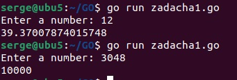
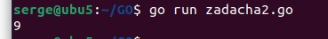
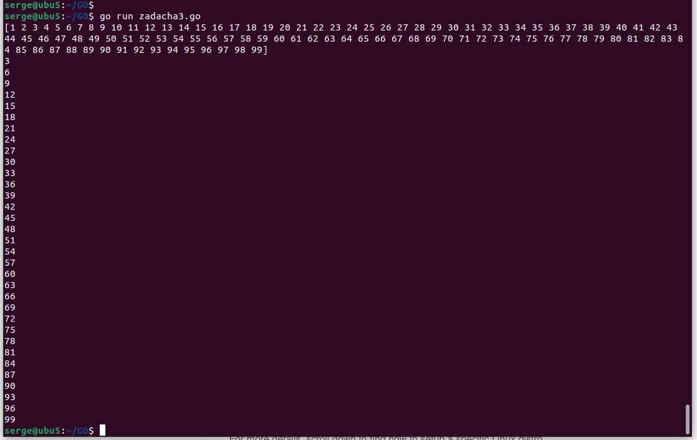

# devops-netology

## Домашнее задание к занятию "7.5. Основы golang"

## Задача 1. Установите golang.

1. Воспользуйтесь инструкций с официального сайта: https://golang.org/.
2. Так же для тестирования кода можно использовать песочницу: https://play.golang.org/.

Ответ:
```bash
sudo apt-get install golang
```
```bash
serge@ubu5:~$ 

serge@ubu5:~$ go version

go version go1.16.2 linux/amd64

serge@ubu5:~$ 
```

## Задача 3. Написание кода.

Цель этого задания закрепить знания о базовом синтаксисе языка. Можно использовать редактор кода на своем компьютере,
либо использовать песочницу: https://play.golang.org/.

1. Напишите программу для перевода метров в футы (1 фут = 0.3048 метр). Можно запросить исходные данные у пользователя, 
а можно статически задать в коде. Для взаимодействия с пользователем можно использовать функцию Scanf:

Ответ:
```bash
package main

import "fmt"

func main() {
        fmt.Print("Enter a number: ")
        //var input float64 = a
        var input float64
        var a float64 = 0.3048
        fmt.Scanf("%f", &input)

        output := input / a

        fmt.Println(output)
}

```



2. Напишите программу, которая найдет наименьший элемент в любом заданном списке, например:

```bash
x := []int{48,96,86,68,57,82,63,70,37,34,83,27,19,97,9,17,}
```

Ответ:
```bash
ackage main

import (
"fmt"
)

func main() {
a := [16]int{48,96,86,68,57,82,63,70,37,34,83,27,19,97,9,17}
var b int = 48
for i := 0; i < len(a); i++ {
//var b int == a[i]

if a[i] <= b {
b = a[i]
}

{
//fmt.Println(a[i])

}

}
fmt.Println(b)
}

```



3. Напишите программу, которая выводит числа от 1 до 100, которые делятся на 3. То есть (3, 6, 9, …)

Ответ:
```bash
package main

import (
"fmt"
)

func main() {
//a := [6]int{1, 2, 3, 4, 5, 6}
a := []int{}
for i := 1; i < 100; i++ {
a = append(a, i)
}
fmt.Println(a)
for i := 0; i < len(a); i++ {
if a[i]%3 == 0 {
fmt.Println(a[i])
}
}
}

```

   