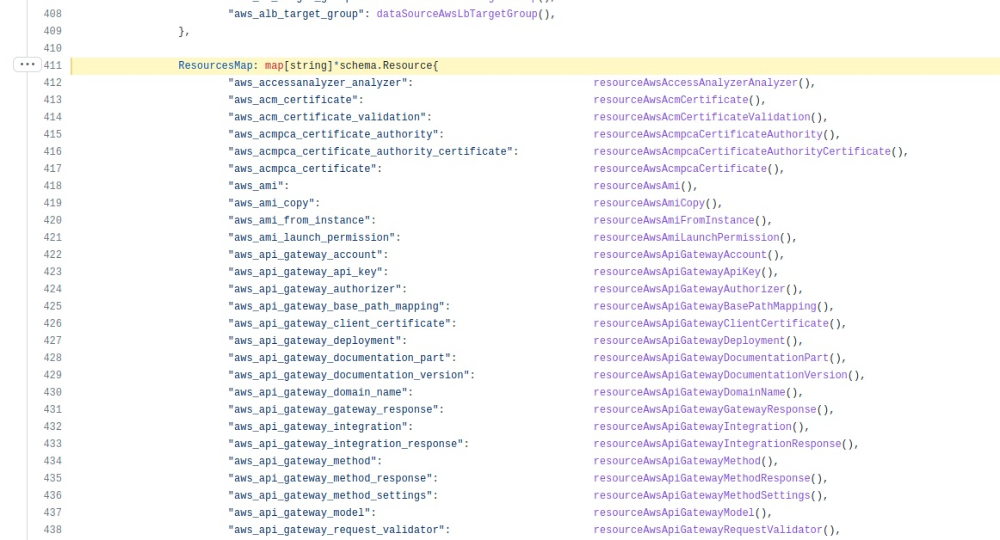
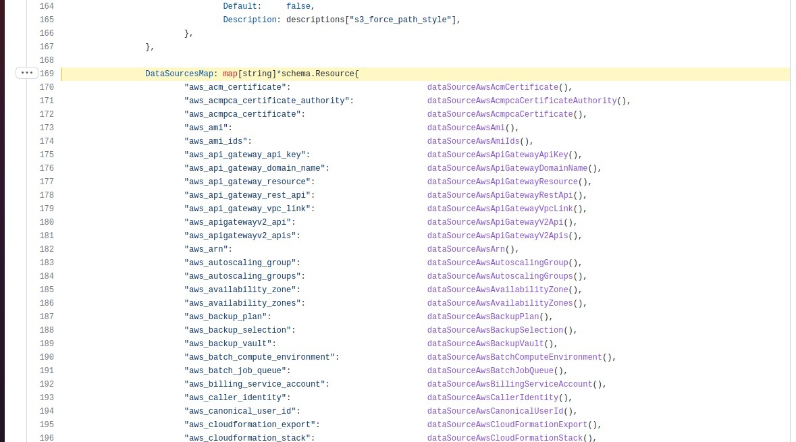
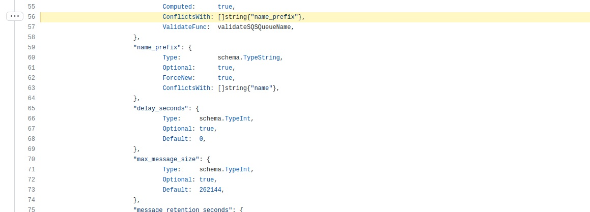
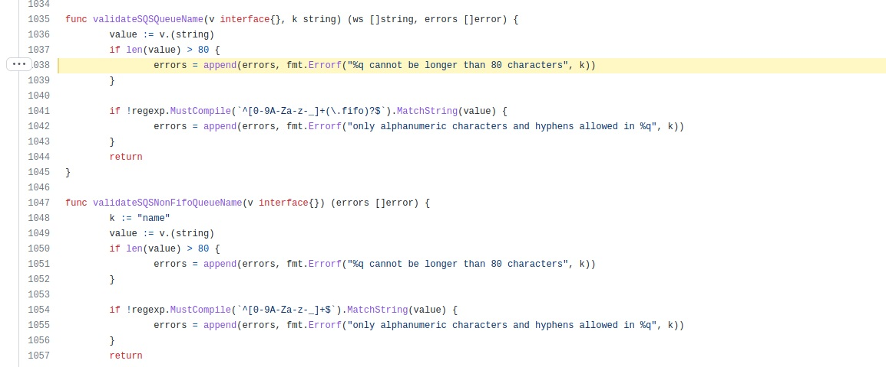
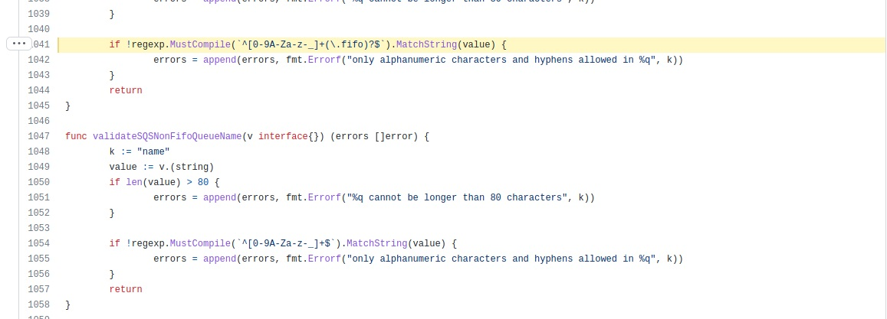

# devops-netology

## Домашнее задание к занятию "7.6. Написание собственных провайдеров для Terraform."

Бывает, что:

 - общедоступная документация по терраформ ресурсам не всегда достоверна,
 - в документации не хватает каких-нибудь правил валидации или неточно описаны параметры,
 - понадобиться использовать провайдер без официальной документации,
 - может возникнуть необходимость написать свой провайдер для системы используемой в ваших проектах.

### Задача 1. 

Давайте потренируемся читать исходный код AWS провайдера, который можно склонировать от сюда:

https://github.com/hashicorp/terraform-provider-aws.git.

Просто найдите нужные ресурсы в исходном коде и ответы на вопросы станут понятны. 

1. Найдите, где перечислены все доступные resource и data_source, приложите ссылку на эти строки в коде на гитхабе.
2. Для создания очереди сообщений SQS используется ресурс aws_sqs_queue у которого есть параметр name.

* С каким другим параметром конфликтует name? Приложите строчку кода, в которой это указано.
* Какая максимальная длина имени?
* Какому регулярному выражению должно подчиняться имя?

Ответ:

resource и data_source:

https://github.com/hashicorp/terraform-provider-aws/blob/8e4d8a3f3f781b83f96217c2275f541c893fec5a/aws/provider.go#L411

https://github.com/hashicorp/terraform-provider-aws/blob/8e4d8a3f3f781b83f96217c2275f541c893fec5a/aws/provider.go#L169

https://github.com/hashicorp/terraform-provider-aws/blob/8e4d8a3f3f781b83f96217c2275f541c893fec5a/aws/resource_aws_sqs_queue.go#L56

Длина имени не более 80 символов.

https://github.com/hashicorp/terraform-provider-aws/blob/8e4d8a3f3f781b83f96217c2275f541c893fec5a/aws/validators.go#L1038

https://github.com/hashicorp/terraform-provider-aws/blob/8e4d8a3f3f781b83f96217c2275f541c893fec5a/aws/validators.go#L1041

