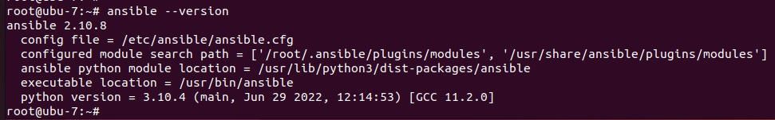
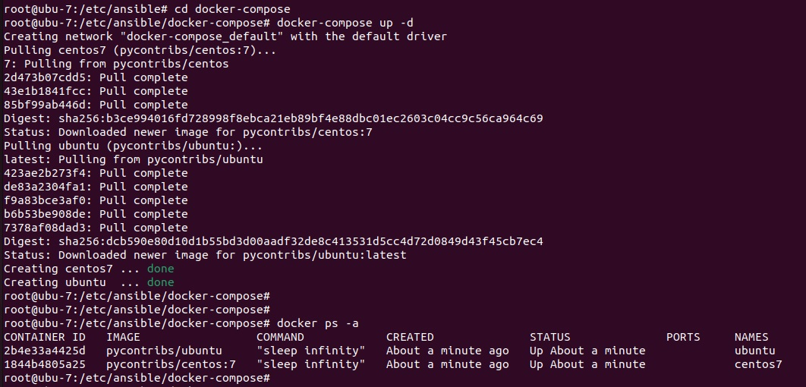
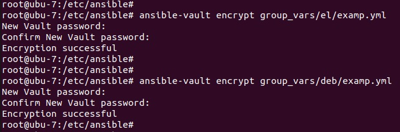
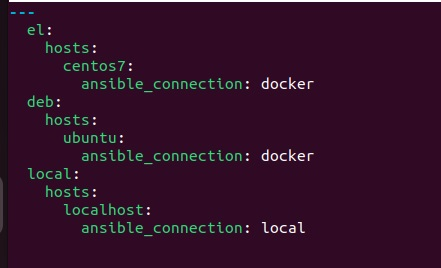

# devops-netology

## Домашнее задание к занятию "08.01 Введение в Ansible"

## Подготовка к выполнению
1. Установите ansible версии 2.10 или выше.
2. Создайте свой собственный публичный репозиторий на github с произвольным именем.
3. Скачайте playbook из репозитория с домашним заданием и перенесите его в свой репозиторий.



## Основная часть
1. Попробуйте запустить playbook на окружении из test.yml, зафиксируйте 
какое значение имеет факт some_fact для указанного хоста при выполнении playbook'a.

```bash
root@ubu-7:/etc/ansible# 
root@ubu-7:/etc/ansible# 
root@ubu-7:/etc/ansible# ansible-playbook site.yml -i inventory/test.yml

PLAY [Print os facts] ******************************************************************************************

TASK [Gathering Facts] *****************************************************************************************
ok: [localhost]

TASK [Print OS] ************************************************************************************************
ok: [localhost] => {
    "msg": "Ubuntu"
}

TASK [Print fact] **********************************************************************************************
ok: [localhost] => {
    "msg": 12
}

PLAY RECAP *****************************************************************************************************
localhost                  : ok=3    changed=0    unreachable=0    failed=0    skipped=0    rescued=0    ignored=0   

root@ubu-7:/etc/ansible# 
```

2. Найдите файл с переменными (group_vars) в котором задаётся найденное в первом пункте значение 
и поменяйте его на 'all default fact'.
```bash
---
  some_fact: "all default fact"
```

3. Воспользуйтесь подготовленным (используется docker) или создайте собственное окружение для проведения дальнейших испытаний.

```bash
root@ubu-7:/etc/ansible# cd docker-compose
root@ubu-7:/etc/ansible/docker-compose# docker-compose up -d
Creating network "docker-compose_default" with the default driver
Pulling centos7 (pycontribs/centos:7)...
7: Pulling from pycontribs/centos
2d473b07cdd5: Pull complete
43e1b1841fcc: Pull complete
85bf99ab446d: Pull complete
Digest: sha256:b3ce994016fd728998f8ebca21eb89bf4e88dbc01ec2603c04cc9c56ca964c69
Status: Downloaded newer image for pycontribs/centos:7
Pulling ubuntu (pycontribs/ubuntu:)...
latest: Pulling from pycontribs/ubuntu
423ae2b273f4: Pull complete
de83a2304fa1: Pull complete
f9a83bce3af0: Pull complete
b6b53be908de: Pull complete
7378af08dad3: Pull complete
Digest: sha256:dcb590e80d10d1b55bd3d00aadf32de8c413531d5cc4d72d0849d43f45cb7ec4
Status: Downloaded newer image for pycontribs/ubuntu:latest
Creating centos7 ... done
Creating ubuntu  ... done
root@ubu-7:/etc/ansible/docker-compose# 
root@ubu-7:/etc/ansible/docker-compose# 
root@ubu-7:/etc/ansible/docker-compose# docker ps -a
CONTAINER ID   IMAGE                 COMMAND            CREATED              STATUS              PORTS     NAMES
2b4e33a4425d   pycontribs/ubuntu     "sleep infinity"   About a minute ago   Up About a minute             ubuntu
1844b4805a25   pycontribs/centos:7   "sleep infinity"   About a minute ago   Up About a minute             centos7
root@ubu-7:/etc/ansible/docker-compose# 
root@ubu-7:/etc/ansible/docker-compose#
```



4. Проведите запуск playbook на окружении из prod.yml. Зафиксируйте полученные значения some_fact для каждого из managed host.

```bash
root@ubu-7:/etc/ansible# ansible-playbook -i inventory/prod.yml -v site.yml
Using /etc/ansible/ansible.cfg as config file

PLAY [Print os facts] *********************************************************************************************************

TASK [Gathering Facts] ********************************************************************************************************
ok: [ubuntu]
ok: [centos7]

TASK [Print OS] ***************************************************************************************************************
ok: [centos7] => {
    "msg": "CentOS"
}
ok: [ubuntu] => {
    "msg": "Ubuntu"
}

TASK [Print fact] *************************************************************************************************************
ok: [centos7] => {
    "msg": "el"
}
ok: [ubuntu] => {
    "msg": "deb"
}

PLAY RECAP ********************************************************************************************************************
centos7                    : ok=3    changed=0    unreachable=0    failed=0    skipped=0    rescued=0    ignored=0   
ubuntu                     : ok=3    changed=0    unreachable=0    failed=0    skipped=0    rescued=0    ignored=0   

root@ubu-7:/etc/ansible# 
```

5. Добавьте факты в group_vars каждой из групп хостов так, чтобы для some_fact получились следующие значения: 
для deb - 'deb default fact', для el - 'el default fact'.

```bash
---
  some_fact: "el default fact"
```

```bash
---
  some_fact: "deb default fact"
```

6. Повторите запуск playbook на окружении prod.yml. Убедитесь, что выдаются корректные значения для всех хостов.

```bash
root@ubu-7:/etc/ansible# ansible-playbook -i inventory/prod.yml -v site.yml
Using /etc/ansible/ansible.cfg as config file

PLAY [Print os facts] *********************************************************************************************************

TASK [Gathering Facts] ********************************************************************************************************
ok: [ubuntu]
ok: [centos7]

TASK [Print OS] ***************************************************************************************************************
ok: [centos7] => {
    "msg": "CentOS"
}
ok: [ubuntu] => {
    "msg": "Ubuntu"
}

TASK [Print fact] *************************************************************************************************************
ok: [centos7] => {
    "msg": "el default fact"
}
ok: [ubuntu] => {
    "msg": "deb default fact"
}

PLAY RECAP ********************************************************************************************************************
centos7                    : ok=3    changed=0    unreachable=0    failed=0    skipped=0    rescued=0    ignored=0   
ubuntu                     : ok=3    changed=0    unreachable=0    failed=0    skipped=0    rescued=0    ignored=0   

root@ubu-7:/etc/ansible# 
```

7. При помощи ansible-vault зашифруйте факты в group_vars/deb и group_vars/el с паролем netology.

```bash
root@ubu-7:/etc/ansible# ansible-vault encrypt group_vars/el/examp.yml
New Vault password: 
Confirm New Vault password: 
Encryption successful
root@ubu-7:/etc/ansible# 
root@ubu-7:/etc/ansible# 
root@ubu-7:/etc/ansible# ansible-vault encrypt group_vars/deb/examp.yml
New Vault password: 
Confirm New Vault password: 
Encryption successful
root@ubu-7:/etc/ansible#
```


8. Запустите playbook на окружении prod.yml. При запуске ansible должен запросить у вас пароль. Убедитесь в работоспособности.
```bash
 root@ubu-7:/etc/ansible# ansible-playbook -i inventory/prod.yml -v site.yml
Using /etc/ansible/ansible.cfg as config file

PLAY [Print os facts] *********************************************************************************************************
ERROR! Attempting to decrypt but no vault secrets found
root@ubu-7:/etc/ansible# 
```
```bash
root@ubu-7:/etc/ansible# ansible-playbook -i inventory/prod.yml site.yml --ask-vault-pass
Vault password: 

PLAY [Print os facts] *********************************************************************************************************

TASK [Gathering Facts] ********************************************************************************************************
ok: [ubuntu]
ok: [centos7]

TASK [Print OS] ***************************************************************************************************************
ok: [centos7] => {
    "msg": "CentOS"
}
ok: [ubuntu] => {
    "msg": "Ubuntu"
}

TASK [Print fact] *************************************************************************************************************
ok: [centos7] => {
    "msg": "el default fact"
}
ok: [ubuntu] => {
    "msg": "deb default fact"
}

PLAY RECAP ********************************************************************************************************************
centos7                    : ok=3    changed=0    unreachable=0    failed=0    skipped=0    rescued=0    ignored=0   
ubuntu                     : ok=3    changed=0    unreachable=0    failed=0    skipped=0    rescued=0    ignored=0   

root@ubu-7:/etc/ansible# 
```
9. Посмотрите при помощи ansible-doc список плагинов для подключения. Выберите подходящий для работы на control node.
  
Для подключения нужен - local.

10. В prod.yml добавьте новую группу хостов с именем local, в ней разместите localhost с необходимым типом подключения.

```bash
---
  el:
    hosts:
      centos7:
        ansible_connection: docker
  deb:
    hosts:
      ubuntu:
        ansible_connection: docker
  local:
    hosts:
      localhost:
        ansible_connection: local
```


11. Запустите playbook на окружении prod.yml. При запуске ansible должен запросить у вас пароль. 
Убедитесь что факты some_fact для каждого из хостов определены из верных group_vars.

```bash
root@ubu-7:/etc/ansible# ansible-playbook -i inventory/prod.yml site.yml --ask-vault-pass
Vault password: 

PLAY [Print os facts] *********************************************************************************************************

TASK [Gathering Facts] ********************************************************************************************************
ok: [localhost]
ok: [ubuntu]
ok: [centos7]

TASK [Print OS] ***************************************************************************************************************
ok: [localhost] => {
    "msg": "Ubuntu"
}
ok: [centos7] => {
    "msg": "CentOS"
}
ok: [ubuntu] => {
    "msg": "Ubuntu"
}

TASK [Print fact] *************************************************************************************************************
ok: [localhost] => {
    "msg": "all default fact"
}
ok: [centos7] => {
    "msg": "el default fact"
}
ok: [ubuntu] => {
    "msg": "deb default fact"
}

PLAY RECAP ********************************************************************************************************************
centos7                    : ok=3    changed=0    unreachable=0    failed=0    skipped=0    rescued=0    ignored=0   
localhost                  : ok=3    changed=0    unreachable=0    failed=0    skipped=0    rescued=0    ignored=0   
ubuntu                     : ok=3    changed=0    unreachable=0    failed=0    skipped=0    rescued=0    ignored=0   

root@ubu-7:/etc/ansible# 
```