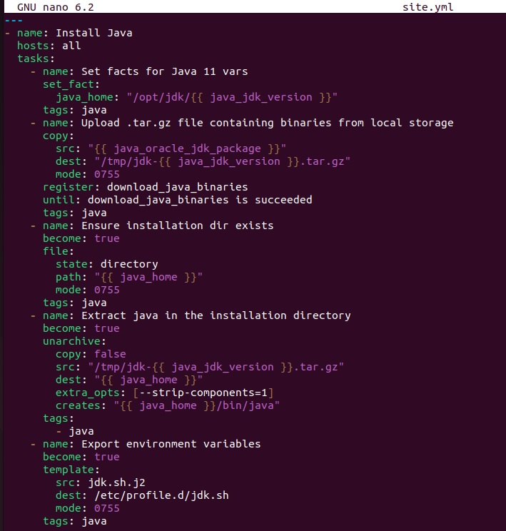

# devops-netology

## Домашнее задание к занятию "08.02 Работа с Playbook"

## Подготовка к выполнению
1. Создайте свой собственный (или используйте старый) публичный репозиторий на github с произвольным именем.
2. Скачайте playbook из репозитория с домашним заданием и перенесите его в свой репозиторий.
3. Подготовьте хосты в соотвтествии с группами из предподготовленного playbook.
4. Скачайте дистрибутив java и положите его в директорию playbook/files/.

## Основная часть
1. Приготовьте свой собственный inventory файл prod.yml
2. Допишите playbook: нужно сделать ещё один play, который устанавливает и настраивает kibana.
3. При создании tasks рекомендую использовать модули: get_url, template, unarchive, file.
4. Tasks должны: скачать нужной версии дистрибутив, выполнить распаковку в выбранную директорию, сгенерировать конфигурацию с параметрами.
5. Запустите ansible-lint site.yml и исправьте ошибки, если они есть.
6. Попробуйте запустить playbook на этом окружении с флагом --check.
7. Запустите playbook на prod.yml окружении с флагом --diff. Убедитесь, что изменения на системе произведены.
8. Повторно запустите playbook с флагом --diff и убедитесь, что playbook идемпотентен.
9. Подготовьте README.md файл по своему playbook. В нём должно быть описано: что делает playbook, какие у него есть параметры и теги.
10. Готовый playbook выложите в свой репозиторий, в ответ предоставьте ссылку на него.

Ответ:
prod.yml
```bash
---
elasticsearch:
  hosts:
    elastic001:
      ansible_connection: docker
kibana:
  hosts:
    kibana001:
      ansible_connection: docker
```


дописываем playbook для установки и настройки kibana

```bash
---
- name: Install Java
  hosts: all
  tasks:
    - name: Set facts for Java 11 vars
      set_fact:
        java_home: "/opt/jdk/{{ java_jdk_version }}"
      tags: java
    - name: Upload .tar.gz file containing binaries from local storage
      copy:
        src: "{{ java_oracle_jdk_package }}"
        dest: "/tmp/jdk-{{ java_jdk_version }}.tar.gz"
        mode: 0755
      register: download_java_binaries
      until: download_java_binaries is succeeded
      tags: java
    - name: Ensure installation dir exists
      become: true
      file:
        state: directory
        path: "{{ java_home }}"
        mode: 0755
      tags: java
    - name: Extract java in the installation directory
      become: true
      unarchive:
        copy: false
        src: "/tmp/jdk-{{ java_jdk_version }}.tar.gz"
        dest: "{{ java_home }}"
        extra_opts: [--strip-components=1]
        creates: "{{ java_home }}/bin/java"
      tags:
        - java
    - name: Export environment variables
      become: true
      template:
        src: jdk.sh.j2
        dest: /etc/profile.d/jdk.sh
        mode: 0755
      tags: java
- name: Install Elasticsearch
  hosts: elasticsearch
  tasks:
    - name: Upload tar.gz Elasticsearch from remote URL
      get_url:
        url: "https://artifacts.elastic.co/downloads/elasticsearch/elasticsearch-{{ elastic_version }}-linux-x86_64.tar.gz"
        dest: "/tmp/elasticsearch-{{ elastic_version }}-linux-x86_64.tar.gz"
        mode: 0644
        timeout: 60
        force: true
        validate_certs: false
      register: get_elastic
      until: get_elastic is succeeded
      tags: elastic
    - name: Create directrory for Elasticsearch
      file:
        state: directory
        path: "{{ elastic_home }}"
        mode: 0755
      tags: elastic
    - name: Extract Elasticsearch in the installation directory
      become: true
      unarchive:
        copy: false
        src: "/tmp/elasticsearch-{{ elastic_version }}-linux-x86_64.tar.gz"
        dest: "{{ elastic_home }}"
        extra_opts: [--strip-components=1]
        creates: "{{ elastic_home }}/bin/elasticsearch"
      tags:
        - elastic
    - name: Set environment Elastic
      become: true
      template:
        src: templates/elk.sh.j2
        dest: /etc/profile.d/elk.sh
        mode: 0755
      tags: elastic
- name: Install Kibana
  hosts: kibana001
  tasks:
    - name: Upload tar.gz Kibana from remote URL
      get_url:
        url: "https://artifacts.elastic.co/downloads/kibana/kibana-{{ kibana_version }}-linux-x86_64.tar.gz"
        dest: "/tmp/kibana-{{ kibana_version }}-linux-x86_64.tar.gz"
        mode: 0755
        timeout: 60
        force: true
        validate_certs: false
      register: get_kibana
      until: get_kibana is succeeded
      tags: kibana
    - name: Create directrory for Kibana ({{ kibana_home }})
      file:
        path: "{{ kibana_home }}"
        state: directory
        mode: 0755
      tags: kibana
    - name: Extract Kibana in the installation directory
      #become: yes
      unarchive:
        copy: false
        src: "/tmp/kibana-{{ kibana_version }}-linux-x86_64.tar.gz"
        dest: "{{ kibana_home }}"
        extra_opts: [--strip-components=1]
        creates: "{{ kibana_home }}/bin/kibana"
        tags:
        - skip_ansible_lint
        - kibana
    - name: Set environment Kibana
      #become: yes
      template:
        mode: 0755
        src: templates/kbn.sh.j2
        dest: /etc/profile.d/kbn.sh
      tags: kibana
```




```bash
root@ubu-7:/etc/ansible# ansible-playbook -i inventory/prod.yml site.yml --check

PLAY [Install Java] ***********************************************************************************************************

TASK [Gathering Facts] ********************************************************************************************************
[DEPRECATION WARNING]: Distribution Ubuntu 18.04 on host kibana001 should use /usr/bin/python3, but is using /usr/bin/python 
for backward compatibility with prior Ansible releases. A future Ansible release will default to using the discovered platform
 python for this host. See https://docs.ansible.com/ansible/2.10/reference_appendices/interpreter_discovery.html for more 
information. This feature will be removed in version 2.12. Deprecation warnings can be disabled by setting 
deprecation_warnings=False in ansible.cfg.
ok: [kibana001]
[DEPRECATION WARNING]: Distribution Ubuntu 18.04 on host elastic001 should use /usr/bin/python3, but is using /usr/bin/python 
for backward compatibility with prior Ansible releases. A future Ansible release will default to using the discovered platform
 python for this host. See https://docs.ansible.com/ansible/2.10/reference_appendices/interpreter_discovery.html for more 
information. This feature will be removed in version 2.12. Deprecation warnings can be disabled by setting 
deprecation_warnings=False in ansible.cfg.
ok: [elastic001]

TASK [Set facts for Java 11 vars] *********************************************************************************************
ok: [elastic001]
ok: [kibana001]

TASK [Upload .tar.gz file containing binaries from local storage] *************************************************************
ok: [elastic001]
ok: [kibana001]

TASK [Ensure installation dir exists] *****************************************************************************************
ok: [kibana001]
ok: [elastic001]

TASK [Extract java in the installation directory] *****************************************************************************
skipping: [elastic001]
skipping: [kibana001]

TASK [Export environment variables] *******************************************************************************************
ok: [elastic001]
ok: [kibana001]

PLAY [Install Elasticsearch] **************************************************************************************************

TASK [Gathering Facts] ********************************************************************************************************
ok: [elastic001]

TASK [Upload tar.gz Elasticsearch from remote URL] ****************************************************************************
changed: [elastic001]

TASK [Create directrory for Elasticsearch] ************************************************************************************
ok: [elastic001]

TASK [Extract Elasticsearch in the installation directory] ********************************************************************
skipping: [elastic001]

TASK [Set environment Elastic] ************************************************************************************************
ok: [elastic001]

PLAY [Install Kibana] *********************************************************************************************************
skipping: no hosts matched

PLAY RECAP ********************************************************************************************************************
elastic001                 : ok=9    changed=1    unreachable=0    failed=0    skipped=2    rescued=0    ignored=0   
kibana001                  : ok=5    changed=0    unreachable=0    failed=0    skipped=1    rescued=0    ignored=0 
```

```bash
root@ubu-7:/etc/ansible# ansible-playbook -i inventory/prod.yml site.yml --diff

PLAY [Install Java] ***********************************************************************************************************

TASK [Gathering Facts] ********************************************************************************************************
[DEPRECATION WARNING]: Distribution Ubuntu 18.04 on host kibana001 should use /usr/bin/python3, but is using /usr/bin/python 
for backward compatibility with prior Ansible releases. A future Ansible release will default to using the discovered platform
 python for this host. See https://docs.ansible.com/ansible/2.10/reference_appendices/interpreter_discovery.html for more 
information. This feature will be removed in version 2.12. Deprecation warnings can be disabled by setting 
deprecation_warnings=False in ansible.cfg.
ok: [kibana001]
[DEPRECATION WARNING]: Distribution Ubuntu 18.04 on host elastic001 should use /usr/bin/python3, but is using /usr/bin/python 
for backward compatibility with prior Ansible releases. A future Ansible release will default to using the discovered platform
 python for this host. See https://docs.ansible.com/ansible/2.10/reference_appendices/interpreter_discovery.html for more 
information. This feature will be removed in version 2.12. Deprecation warnings can be disabled by setting 
deprecation_warnings=False in ansible.cfg.
ok: [elastic001]

TASK [Set facts for Java 11 vars] *********************************************************************************************
ok: [elastic001]
ok: [kibana001]

TASK [Upload .tar.gz file containing binaries from local storage] *************************************************************
ok: [elastic001]
ok: [kibana001]

TASK [Ensure installation dir exists] *****************************************************************************************
ok: [kibana001]
ok: [elastic001]

TASK [Extract java in the installation directory] *****************************************************************************
skipping: [elastic001]
skipping: [kibana001]

TASK [Export environment variables] *******************************************************************************************
ok: [elastic001]
ok: [kibana001]

PLAY [Install Elasticsearch] **************************************************************************************************

TASK [Gathering Facts] ********************************************************************************************************
ok: [elastic001]

TASK [Upload tar.gz Elasticsearch from remote URL] ****************************************************************************
ok: [elastic001]

TASK [Create directrory for Elasticsearch] ************************************************************************************
ok: [elastic001]

TASK [Extract Elasticsearch in the installation directory] ********************************************************************
skipping: [elastic001]

TASK [Set environment Elastic] ************************************************************************************************
ok: [elastic001]

PLAY [Install Kibana] *********************************************************************************************************
skipping: no hosts matched

PLAY RECAP ********************************************************************************************************************
elastic001                 : ok=9    changed=0    unreachable=0    failed=0    skipped=2    rescued=0    ignored=0   
kibana001                  : ok=5    changed=0    unreachable=0    failed=0    skipped=1    rescued=0    ignored=0   

root@ubu-7:/etc/ansible# 
root@ubu-7:/etc/ansible# 

```
GROUP VARS
java_oracle_jdk_package - имя пакета установки Java java_jdk_version - используемая версия Java

elastic_home - переменная домашнего каталога для Elasticsearch kibana_home - переменная для домашнего каталога 
для Kibana elastic_version - версия Elasticsearch kibana_version - версия Kibana


Playbook станавливает на хост три приложения :
* Java
* Elasticsearch
* Kibana

Дистрибутив Java в .tar.gz архиве нужно предварительно скачать и положить в папку files.

Дистрибутивы Elasticsearch и Kibana будут скачаны из удаленнорго репозитория.

теги:
- java
- elastic
- kibana

