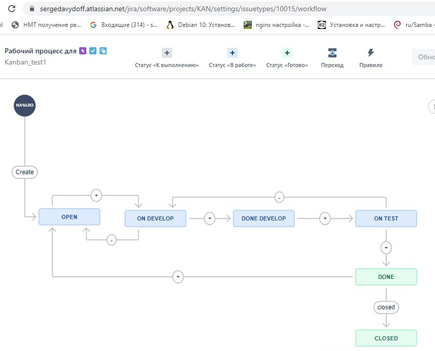
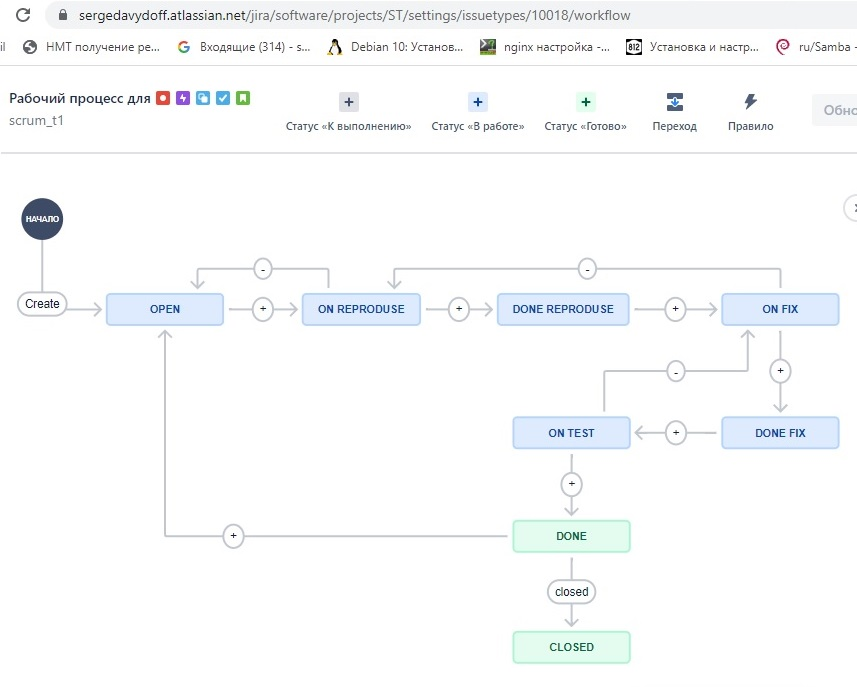

# devops-netology

## Домашнее задание к занятию "09.01 Жизненный цикл ПО"

### Подготовка к выполнению
1. Получить бесплатную JIRA
2. Настроить её для своей "команды разработки"
3. Создать доски kanban и scrum

Ответ:

Исполняемые процессы 

Выгружаем данные в xml

