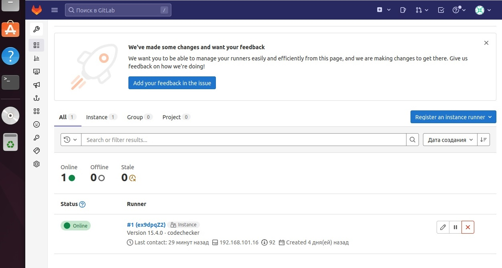
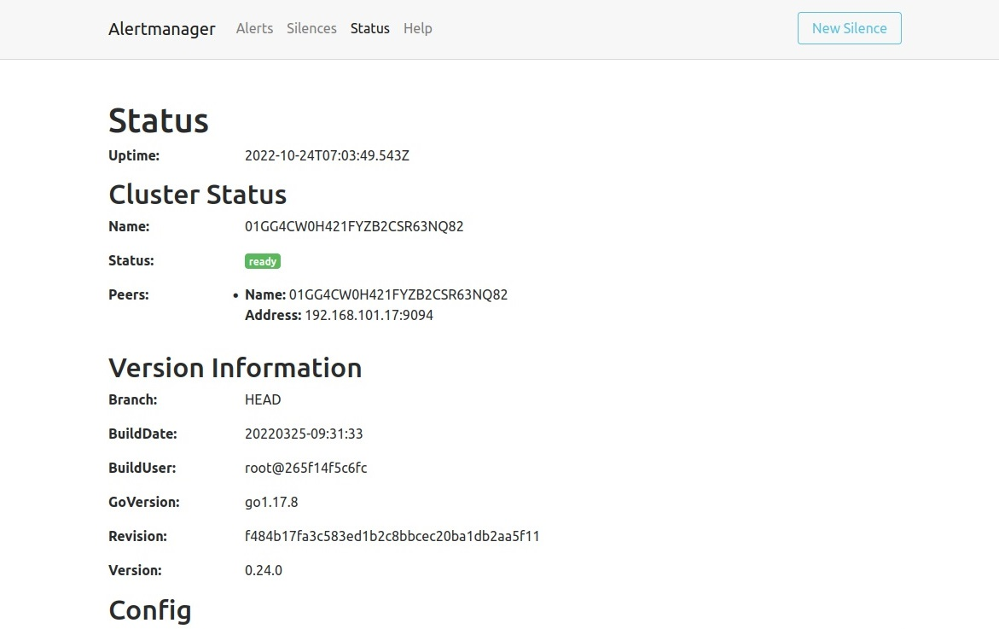

# Дипломное задание по курсу «DevOps-инженер»

## Дипломный практикум в Yandex Cloud .

## Цели:

1.Зарегистрировать доменное имя (любое на ваш выбор в любой доменной зоне).

2.Подготовить инфраструктуру с помощью Terraform на базе облачного провайдера YandexCloud.

3.Настроить внешний Reverse Proxy на основе Nginx и LetsEncrypt.

4.Настроить кластер MySQL.

5.Установить WordPress.

6.Развернуть Gitlab CE и Gitlab Runner.

7.Настроить CI/CD для автоматического развёртывания приложения.

8.Настроить мониторинг инфраструктуры с помощью стека: Prometheus, Alert Manager и Grafana.

### Инфраструктура развернута в Yandex Cloud. Файлы описания находятся в каталоге в качестве базовых используются образы Ubuntu 20.04 

Настроен хостинг DNS для домена в YandexCloud ns1.yandexcloud.net и ns2.yandexcloud.net

Структура файлов:

```mains.tf``` содержит настройки для ```reverse-proxy```. Настройки instance.
```providers.tf``` Содержит настройки для подклчюения к провайдеру.
```variables.tf``` ```network.tf``` Содержит настройки сетей.
```inventory.tf``` Содержит описание подключение к хостам и записывает его в папку ```ansible```.
```group_vars.tf``` Описание переменных и запись в ```/ansible/group_vars/all.yml```
Создание ```S3 bucket``` было решено выполнить через графический интерфейс Yandex.


Следующим этапом является подготовка, настройка инфраструктуры с помощью Terraform на базе облачного провайдера YandexCloud.

В результате при помощи соответстувующих команд ```terraform plan``` и  ```terraform apply``` мы получаем развернутую инфраструктуру в облаке Яндекса.


При помощи ```ansible``` настроли необходимые сервисы на серверах. 
Устанвен ```Nginx```,  сертификаты ```LetsEncrypt```, кластер ```MySQL``` (```DB1``` , ```DB2```).


Устанвлен ```WordPress```.


Установлены ```Gitlab CE``` и ```Gitlab Runner```



Установлены: ```Prometheus,  Node Exporter```.


Установлена: ```Grafana```


Установлен: ```Alert Manager```




Р.S.: Задание Дипломного Проекта оказалось интересным, не скажу,что что все давалось легко, можно сказать что даже сложно.
Но благодаря трудностям мы учимся и постигаем новое. Спасибо Вам Большое! 